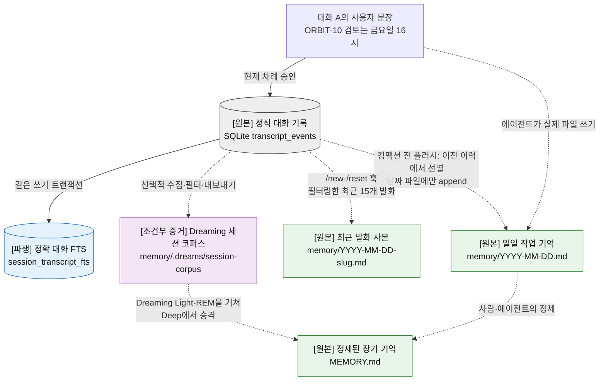
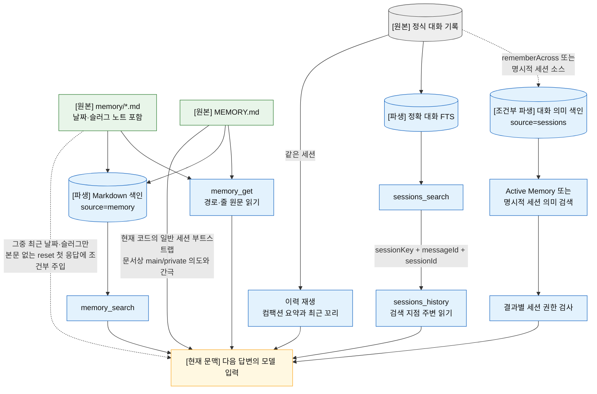
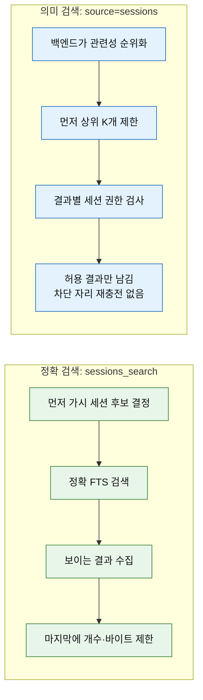
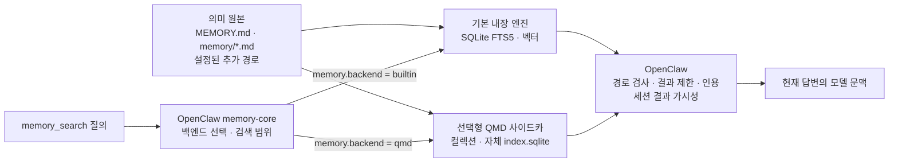

# 1장. 한 문장은 어떻게 기억이 되는가

OpenClaw의 정상적인 사용자·어시스턴트 메시지는 대화 기록으로 남을 수 있다. 그러나 모든 메시지가 의미 기억이 되는 것은 아니며, 의미 기억이 모두 `MEMORY.md`라는 장기 기억으로 승격되는 것도 아니다. 벡터 색인은 기억을 만드는 장소가 아니라, 이미 존재하는 기록을 다른 표현으로 다시 찾기 위한 파생물이다.

이 세 문장을 구분하면 현재 메모리 구조의 대부분이 풀린다. OpenClaw에서 “기억한다”는 말이 적어도 네 가지 서로 다른 사건을 가리키기 때문이다.

- **연속**: 같은 대화를 이어 간다.
- **보존**: 오간 발화를 원래 순서와 출처 그대로 남긴다.
- **선별**: 앞으로도 쓸 사실만 골라 파일에 적는다.
- **회상**: 적어 둔 자료를 검색해 지금 답변에 되가져온다.

네 사건은 저장소도, 담당자도, 보장 수준도 다르다. 정상적으로 승인된 사용자·어시스턴트 텍스트의 대화 기록 보존은 런타임이 맡지만, 선별은 에이전트의 행동에 달려 있고 회상은 다시 권한 검사를 통과해야 한다. 이 넷을 한 단어로 뭉쳐 “메모리”라고 부르는 순간 구조가 엉킨다.

이 장은 2026-07-18의 `main`, [`a115af277410`](https://github.com/openclaw/openclaw/tree/a115af277410a91fb039d2ed699eafad706f5c73)을 기준으로 네 사건을 한 대화의 처음부터 다음 대화의 회상까지 순서대로 따라간다. 먼저 한 문장이 어떤 원본으로 갈라지는지 보고(연속·보존·선별), 이어서 그 원본을 다시 찾는 길을 따라간 뒤(회상), 마지막으로 각 선택 기능이 이 흐름의 어느 단계를 바꾸는지 정리한다. 이 장만 읽어도 현재 기본 `memory-core`의 저장소, 컴팩션, 장기 기억, 키워드·벡터 검색, 대화 간 회상, 권한 경계를 한 덩어리로 설명할 수 있도록 구성했다.

[← 이전: 프롤로그](00-prologue-and-method.md) · [목차](README.md) · [다음: 기원 →](02-origins-2025.md)

## 이 장의 지도

- [다섯 상태](#먼저-구분해야-할-다섯-상태)에서 현재 문맥과 네 저장 장부를 구분한다.
- [`ORBIT-10`의 생애](#orbit-10-한-대화를-끝까지-따라가기)를 따라 대화 기록, 컴팩션, 의미 기억 포획을 본다.
- [다음 대화가 과거를 읽는 다섯 길](#다음-대화가-과거를-읽는-다섯-길)에서 부트스트랩·도구·Active Memory·대화 검색을 비교한다.
- [선택 기능의 위치](#선택-기능은-어느-단계를-바꾸는가)와 [QMD](#qmd-explained)의 역할을 기본 경로와 분리한다.
- [삭제 책임](#삭제는-검색의-반대말이-아니다)과 [현재 계약의 주의점](#현재-계약에서-독자가-알아야-할-주의점)으로 남은 경계를 확인한다.

## 먼저 구분해야 할 다섯 상태

프롤로그의 네 장부는 한 번의 모델 호출이 끝난 뒤에도 남는 저장 상태를 셌다. 이 장에서는 그 네 상태에 답변을 만드는 동안만 존재하는 **현재 모델 문맥**을 더해 다섯 상태로 본다. 분류가 바뀐 것이 아니라, 저장된 자료가 이번 답변에 들어오는 마지막 자리까지 펼쳐 보는 것이다.

독자가 가장 먼저 버려야 할 그림은 “대화 → 장기 기억 → 벡터 DB”라는 한 줄짜리 파이프라인이다. 실제 구조는 한 대화에서 여러 상태가 갈라지고, 다음 답변을 만들 때 다시 합쳐지는 형태다.

| 상태             | 기준 원본 또는 소유자                                       | 무엇을 보존하는가                                                                  | 다음 답변에는 어떻게 들어오는가                                |
| ---------------- | ----------------------------------------------------------- | ---------------------------------------------------------------------------------- | -------------------------------------------------------------- |
| 현재 모델 문맥   | 이번 실행에서 조립된 프롬프트                               | 지금 모델이 실제로 볼 수 있는 대화 이력, 컴팩션 요약, 부트스트랩 파일, 선택적 회상 | 그 답변을 만드는 동안만 모델 입력으로 존재한다.                |
| 정식 대화 기록   | 에이전트별 SQLite의 세션·`transcript_events`                | 사용자·어시스턴트 차례와 세션의 정식 이력                                          | 같은 세션의 이력 재생, `sessions_history`, 정확 검색에 쓰인다. |
| 일일 작업 기억   | `memory/YYYY-MM-DD.md`와 슬러그 변형                        | 아직 세밀하고 임시적일 수 있는 관찰, 결정, 세션 꼬리                               | 새 세션의 최근 노트 주입 또는 `memory_search`로 되찾는다.      |
| 정제된 장기 기억 | 정확한 대문자 루트 파일 `MEMORY.md`                         | 오래 유지할 사실, 선호, 결정, 짧은 요약                                            | 일반 세션의 부트스트랩 문맥과 `memory_search`에 들어간다.      |
| 파생 검색 색인   | 내장 SQLite FTS·벡터 테이블 또는 [QMD 색인](#qmd-explained) | 원본의 청크, 키워드, 임베딩, 순위화 메타데이터                                     | 검색 결과를 만들 뿐이다. 원본에서 다시 만들 수 있다.           |

이 다섯 상태는 앞의 네 사건과 이렇게 맞물린다. **연속**은 정식 대화 기록을 현재 모델 문맥으로 재생하는 결합이, **보존**은 정식 대화 기록이, **선별**은 일일 작업 기억과 정제된 장기 기억이, **회상**은 파생 검색 색인이 주로 담당한다. 상태 하나가 사건 하나를 독점하지는 않지만, 지금 어떤 사건을 이야기하는지 정하면 어느 상태를 들여다봐야 하는지도 함께 정해진다.

여기서 SQLite가 두 번 등장한다고 해서 두 상태가 같지는 않다. 정식 대화 행은 원본이고, 그 옆의 FTS·벡터 테이블은 찾기 위한 파생 상태다. 반대로 Markdown은 “모든 런타임 상태”의 원본이 아니라 **사람이 읽고 고칠 수 있는 의미 기억**의 원본이다. 정식 세션·대화 기록은 SQLite가 소유하고, 기본 `memory-core` 내장 경로의 색인과 기계 상태도 SQLite에 둔다. QMD·LanceDB 같은 대체 백엔드는 뒤에서 보듯 자기 저장소를 쓸 수 있다.

표를 읽는 데 필요한 용어만 먼저 정해 두자. 이 장에서 **에이전트**(agent)는 자기 워크스페이스와 에이전트별 DB를 가진 실행 주체이고, **워크스페이스**(workspace)는 사람이 편집할 수 있는 기억 파일이 놓이는 공간이다. **세션 키**(session key)는 대화가 속한 논리적 통로의 라우팅 이름이며, **세션 ID**(session ID)는 리셋과 리셋 사이의 구체적인 대화 구간을 가리킨다. 하나의 세션 키가 `/reset` 뒤 새 세션 ID를 가리킬 수 있는 이유가 여기에 있다. 검색에 쓰이는 용어는 실제로 검색을 다루는 [뒷절](#벡터는-기억이-아니라-찾아보기다)에서 꺼낸다.

> **보안 범위 주의:** 아래에서 `MEMORY.md`가 “일반 세션 부트스트랩”에 들어간다고 쓰는 것은 현재의 실제 코드 동작이다. 공식 문서는 main/private 대화만을 의도하지만 현재 필터는 그 범위를 완전히 강제하지 않는다. 장 끝의 [계약 주의점](#현재-계약에서-독자가-알아야-할-주의점)에서 코드와 문서의 차이를 함께 설명한다.

## ORBIT-10: 한 대화를 끝까지 따라가기

이제 다음 합성 대화를 생각해 보자.

**사용자:** “ORBIT-10의 배포 검토는 매주 금요일 오후 4시야. 승인은 Mina가 하고, 지연 시간은 밀리초로 보고해. 지난 장애 코드는 `E_DEPLOY_413`이었어. 다음 대화에서도 기억해 줘.”

**OpenClaw:** “알겠어요. ORBIT-10의 배포 규칙과 장애 코드를 기억해 둘게요.”

이 짧은 대화 뒤에는 무엇이 자동으로 남고, 무엇은 별도 행동이 있어야 남을까?

답을 흐리지 않으려면 “대화 궤적”이라는 말부터 셋으로 쪼개야 한다. 말한 순서와 출처를 보존한 원본은 **정식 대화 기록**이다. 그 기록을 의미 검색용으로 색인하면 `source=sessions`인 **검색 가능한 과거 대화**가 된다. 일부를 워크스페이스 Markdown으로 옮기면 비로소 `source=memory`인 **의미 기억 파일**이 된다. 앞의 상태 표로 옮기면 첫째는 정식 대화 기록, 둘째는 파생 검색 색인, 셋째는 일일 작업 기억과 정제된 장기 기억에 해당한다. 첫째에서 둘째로 가는 색인은 원본을 장기 기억으로 승격하지 않고, 첫째에서 셋째로 가는 복사·선별은 저장 형식과 권한 경계를 함께 바꾼다.

### 첫째, 메시지는 먼저 대화 기록이 된다

정상적으로 받아들여진 사용자 차례는 답변 실행 직전에 SQLite 대화 기록에 들어가고, 어시스턴트 메시지도 세션 관리자를 통해 이어서 기록된다. 현재 활성 분기를 모호함 없이 연장하는 사용자·어시스턴트 텍스트는 같은 쓰기 트랜잭션에서 정확 검색용 `session_transcript_fts`에도 투영된다. 그래서 `E_DEPLOY_413` 같은 문자열은 별도의 벡터 임베딩을 기다리지 않고 `sessions_search`로 찾을 수 있다. 도구 결과, 추론 블록, 이미지는 이 정확 검색 대상에서 빠진다. 이 계약은 [대화 행과 FTS의 동시 기록](https://github.com/openclaw/openclaw/blob/a115af277410a91fb039d2ed699eafad706f5c73/src/config/sessions/session-accessor.sqlite-transcript-store.ts#L38-L95), [활성 분기 투영](https://github.com/openclaw/openclaw/blob/a115af277410a91fb039d2ed699eafad706f5c73/src/config/sessions/session-transcript-index.ts#L175-L248), [세션 검색 문서](https://github.com/openclaw/openclaw/blob/a115af277410a91fb039d2ed699eafad706f5c73/docs/concepts/session-search.md#L24-L37)에 명시되어 있다.

이때 ORBIT-10 문장은 아직 `MEMORY.md`가 아니다. “기억해 줘”라는 문구는 에이전트가 메모리 파일을 갱신해야 한다는 강한 의도 신호지만, 저장을 완성하는 것은 별도의 파일 쓰기 행동이다. 기본 워크스페이스 지침도 “누군가 기억하라고 하면 날짜 노트나 관련 파일을 갱신하라”고 가르친다. 즉 보존은 런타임이 보장하는 경로이고, 선별은 에이전트가 수행하는 경로다. [기본 메모리 지침](https://github.com/openclaw/openclaw/blob/a115af277410a91fb039d2ed699eafad706f5c73/docs/reference/templates/AGENTS.md#L26-L47)이 그 차이를 보여 준다.

따라서 어시스턴트가 “기억해 둘게요”라고 말했더라도 실제 파일 쓰기가 없었다면 남는 것은 대화 기록과 정확 FTS뿐이다. 파일 쓰기 도구가 성공했다면, 예를 들어 다음과 같은 별도 원본이 생긴다.

```markdown
## ORBIT-10 배포 규칙

- 검토: 매주 금요일 16:00
- 승인자: Mina
- 지연 시간 보고 단위: ms
- 지난 장애 코드: E_DEPLOY_413
```

이 사실은 시스템 안에서 다음 네 모습으로 변한다. 아래 색인 청크는 이해를 위한 개념 카드이지 실제 DB 행 형식을 복제한 것은 아니다.

| 단계                   | ORBIT-10의 모습                                                                 | 이 단계가 새로 하는 일                                             |
| ---------------------- | ------------------------------------------------------------------------------- | ------------------------------------------------------------------ |
| 정식 대화 기록         | 사용자가 말한 원문과 어시스턴트 답변                                            | 실제 대화의 출처와 순서를 보존한다.                                |
| `memory/2026-07-18.md` | 위처럼 규칙을 항목으로 정리한 Markdown                                          | 앞으로 쓸 의미를 사람이 읽고 고칠 수 있게 선별한다.                |
| 검색 청크              | `source: memory`, `path: memory/2026-07-18.md`, 줄 범위, 본문, 선택적 embedding | 정확 단어와 비슷한 의미로 찾을 수 있게 파생 표현을 만든다.         |
| 다음 모델 문맥         | “ORBIT-10 배포는 Mina 승인, 금요일 16시 검토” 같은 제한된 원문 또는 회상 요약   | 부트스트랩·도구·Active Memory 중 한 경로로 이번 답변에만 가져온다. |

### 둘째, 같은 대화에서는 검색보다 이력이 먼저다

사용자가 바로 다음 차례에 “승인자는 누구였지?”라고 물으면, 보통 `memory_search`가 필요하지 않다. 같은 세션의 최근 대화가 현재 모델 문맥에 재생되기 때문이다. 대화가 너무 길어지면 컴팩션이 오래된 차례를 요약해 세션 대화 기록에 새 컴팩션 항목으로 저장하고 최근 꼬리를 보존한다. 원래 전체 이력은 디스크에 남고, 달라지는 것은 다음 실행에서 모델이 보는 축약된 문맥이다. [컴팩션의 저장 의미](https://github.com/openclaw/openclaw/blob/a115af277410a91fb039d2ed699eafad706f5c73/docs/concepts/compaction.md#L9-L20)를 보라.

여기에는 세 가지를 구분해야 한다.

- **대화 이력 재생**은 같은 세션을 이어 가는 기본 경로다.
- **컴팩션 요약**은 같은 세션 안의 정식 대화 기록이다. 장기 기억 파일이 아니다.
- **컴팩션 전 메모리 플러시**는 컴팩션 전에 중요한 사실을 날짜 노트로 옮길 기회를 주는 별도 유지보수 차례다.

세부 순서는 더 미묘하다. 새 사용자 메시지는 메모리 플러시·사전 컴팩션의 압력 계산에는 포함되지만, 그 유지보수가 끝난 뒤에야 정식 사용자 차례로 승인·기록된다. 그러므로 “현재 막 도착한 문장이 같은 실행의 컴팩션 전 플러시로 반드시 저장된다”고 가정해서는 안 된다. 런너의 [플러시 → 컴팩션 → 현재 차례 승인 순서](https://github.com/openclaw/openclaw/blob/a115af277410a91fb039d2ed699eafad706f5c73/src/auto-reply/reply/agent-runner.ts#L1784-L1891)가 이를 고정한다.

### 셋째, 대화 기록에서 의미 기억으로 가는 길은 하나가 아니다

ORBIT-10 규칙이 `memory/` 또는 `MEMORY.md`에 나타나는 데에는 서로 다른 동기와 보장을 가진 경로가 있다.

| 저장 경로              | 언제 일어나는가                                                    | 무엇을 쓰는가                                                                              | 장기 기억인가                                    |
| ---------------------- | ------------------------------------------------------------------ | ------------------------------------------------------------------------------------------ | ------------------------------------------------ |
| 에이전트의 명시적 기록 | “기억해 줘” 요청을 따르거나 에이전트가 중요한 사실이라고 판단할 때 | 보통 날짜 노트나 관련 Markdown. 사람·에이전트가 `MEMORY.md`를 직접 정제할 수도 있다.       | 파일 위치와 내용에 달려 있다.                    |
| 컴팩션 전 플러시       | 세션이 컴팩션에 가까워질 때, 기본 활성                             | 모델이 선별한 사실을 정확한 `memory/YYYY-MM-DD.md`에 append                                | 아니요. 일일 작업 기억이다.                      |
| `session-memory` 훅    | 훅이 활성화된 상태에서 `/new` 또는 `/reset`                        | 최근 사용자·어시스턴트 메시지 기본 15개를 새 `memory/YYYY-MM-DD-<slug>.md`에 비동기로 복사 | 아니요. 최근 대화 꼬리의 별도 Markdown 사본이다. |
| Dreaming Deep 승격     | 선택적 Dreaming이 충분한 회상·다양성·점수 근거를 모았을 때         | 자격 있는 후보를 `MEMORY.md`로 승격                                                        | 예. 자동 승격 경로다.                            |

컴팩션 전 플러시는 특히 자주 오해된다. 현재 계획은 날짜 파일 하나만 append하도록 강제하며 `MEMORY.md`, `DREAMS.md`, `SOUL.md`, `TOOLS.md`, `AGENTS.md`는 이 차례에서 읽기 전용이다. 따라서 “컴팩션이 곧 장기 기억을 갱신한다”는 설명은 틀리다. 정확한 계약은 [플러시 대상과 append-only 규칙](https://github.com/openclaw/openclaw/blob/a115af277410a91fb039d2ed699eafad706f5c73/extensions/memory-core/src/flush-plan.ts#L15-L43)에 있다.

`session-memory` 훅도 플러시와 다르다. 표준 온보딩은 이 번들 훅을 활성화하고, 훅은 리셋 명령의 응답을 막지 않도록 백그라운드에서 새 슬러그 파일을 쓴다. 파일 머리말은 “Conversation Summary”지만, 내용은 의미를 다시 쓴 요약이 아니라 필터링한 최근 사용자·어시스턴트 발화의 사본이다. 기본 15개라는 수는 “최근 대화 꼬리”의 경계이지 중요도 판정이 아니다. [온보딩 기본값](https://github.com/openclaw/openclaw/blob/a115af277410a91fb039d2ed699eafad706f5c73/src/commands/onboard-hooks.ts#L1-L38)과 [훅의 읽기·쓰기·비동기 실행](https://github.com/openclaw/openclaw/blob/a115af277410a91fb039d2ed699eafad706f5c73/src/hooks/bundled/session-memory/handler.ts#L198-L349)을 함께 읽어야 한다. 비동기이므로 리셋 직후의 첫 시작 문맥에 방금 쓴 파일이 반드시 들어간다고 보장할 수는 없다.

ORBIT-10 대화가 훅을 통과했다면 파일의 핵심 모양은 다음과 같다. 값은 설명을 위한 합성 예시지만 머리말과 역할 표시는 실제 형식을 따른다.

```markdown
# Session: 2026-07-18 17:02:00 KST

- **Session Key**: agent:main:main
- **Session ID**: orbit-session-a
- **Source**: webchat

## Conversation Summary

user: ORBIT-10의 배포 검토는 매주 금요일 오후 4시야. ...
assistant: 알겠어요. ORBIT-10의 배포 규칙을 기억해 둘게요.
```

마지막으로 대화를 파일에 옮기는 순간에는 권한의 의미도 바뀐다.

| 상태                   | 남아 있는 출처 정보                                   | 검색에서의 분류와 권한                                                |
| ---------------------- | ----------------------------------------------------- | --------------------------------------------------------------------- |
| 훅 실행 전 대화 행     | 형식화된 세션 키·세션 ID·메시지 ID와 세션 별칭        | `source=sessions`; 세션 가시성 또는 보호된 비공개 대화 검사를 거친다. |
| 훅 실행 뒤 슬러그 파일 | 머리말에 세션 키·세션 ID가 일반 텍스트로 적힐 수 있음 | `source=memory`; 세션 권한 검사에 쓸 형식화된 출처는 이어받지 않는다. |

원래 대화 텍스트가 `session-memory` 훅을 거쳐 `memory/*.md`가 되면 이후 검색기는 이를 일반 Markdown 기억으로 취급한다. 보호된 대화 기록 결과 필터를 그대로 물려받지 않는다. 이것은 검색 구현의 사소한 차이가 아니라, **저장 형식이 바뀌면서 권한 분류도 바뀌는 경계**다.

### 여기까지 갈라진 원본들

세 갈래를 한 장에 겹쳐 보면 “무엇이 남는가”가 정리된다. 실선은 정상 차례에서 반드시 일어나는 경로, 점선은 에이전트 행동·훅·설정 기능이 필요한 경로다. `[원본]`은 이후 판단의 근거가 되는 기록이고, `[파생]`은 원본에서 다시 만들 수 있으며, `[조건부 증거]`는 선택 기능이 따로 수집한 자료다.



이 그림에는 일부러 “하나의 장기 기억 DB”를 넣지 않았다. `transcript_events`, 날짜 Markdown, 슬러그 Markdown, `MEMORY.md`는 목적이 다른 원본이다. 정확 대화 FTS는 대화 원본의 파생물이다. Dreaming의 세션 코퍼스 수집은 보호된 Active Memory 검색과 같은 문이 아니라, 승격 후보를 만들기 위한 별도 수집·필터 정책이다.

## 일일 기억과 장기 기억은 어떻게 다른가

갈라진 원본 가운데 사람이 직접 읽고 고칠 수 있는 의미 기억은 Markdown이다. 기본 `memory-core`에서 그 계층은 다음과 같이 나뉜다.

- 정확한 대문자 `MEMORY.md`는 오래 유지할 사실·선호·결정·짧은 요약의 정제 계층이다. 원시 대화 전체를 쌓는 곳이 아니다.
- `memory/YYYY-MM-DD.md`와 슬러그 변형은 상세한 관찰, 세션 요약, 아직 가치가 검증되지 않은 작업 맥락을 담는 일일 계층이다.
- `DREAMS.md`는 선택적 Dreaming의 사람 검토용 산출물이다. 기본 검색 코퍼스에는 자동 포함되지 않지만 `memory_get`으로 경로를 지정해 읽을 수 있다.
- Codex·Claude Code 등에서 가져온 기억은 원본을 바꾸지 않고 `memory/imports/<source>/` 아래에 놓이며 일반 Markdown 메모리처럼 색인된다.

계층이 나뉘어 있다고 해서 워크스페이스의 모든 Markdown이 기억이 되는 것은 아니다. 내장 스캐너는 루트의 정확한 `MEMORY.md`, `memory/` 아래의 자격 있는 파일, 설정한 추가 경로만 모은다. 워크스페이스 루트의 임의 Markdown을 전부 읽지 않으며, 심볼릭 링크를 건너뛰고 같은 실제 경로를 중복 제거한다. [코퍼스 열거 규칙](https://github.com/openclaw/openclaw/blob/a115af277410a91fb039d2ed699eafad706f5c73/packages/memory-host-sdk/src/host/internal.ts#L153-L230)과 [안전한 파일 읽기](https://github.com/openclaw/openclaw/blob/a115af277410a91fb039d2ed699eafad706f5c73/packages/memory-host-sdk/src/host/read-file.ts#L67-L181)가 이 경계를 구현한다.

예를 들어 루트에 `orbit-notes.md`를 만들기만 해서는 기본 코퍼스가 되지 않는다. `memory/orbit-notes.md`에 두거나 추가 경로로 설정해야 한다. 반대로 `memory/dreaming/` 아래의 자격 있는 Markdown은 현재 일반 검색에 들어갈 수 있지만 Dreaming 승격 절차는 그 경로를 제외한다. 검색 자격과 승격 자격은 서로 다른 계약이며, 열린 [#71285](https://github.com/openclaw/openclaw/issues/71285)는 이 경계가 아직 완전히 정리되지 않았음을 보여 준다.

여기까지가 “무엇이 남는가”다. 이제 남은 것을 어떻게 다시 찾아 오는지로 넘어간다.

## 벡터는 기억이 아니라 찾아보기다

회상을 이야기하려면 용어 셋이 더 필요하다. **코퍼스**(corpus)는 한 번의 검색이 대상으로 삼는 원본 집합이다. **FTS**(전체 텍스트 검색)는 정확한 단어와 식별자를 찾는 키워드 색인이고, **임베딩**(embedding)은 문장이나 청크의 의미를 숫자 벡터로 표현한 것이다. 벡터 검색은 표현이 달라도 가까운 의미를 찾는다. 이 셋은 저장소 이름이 아니라 역할의 이름이라는 점이 중요하다.

ORBIT-10 예제로 두 검색 방식을 갈라 보자.

```markdown
- ORBIT-10 배포 검토: 매주 금요일 16:00
- 승인자: Mina
- 지연 시간 단위: ms
- 지난 장애 코드: E_DEPLOY_413
```

FTS는 `ORBIT-10`, `Mina`, `E_DEPLOY_413`처럼 철자가 보존된 표현에 강하다. 벡터 검색은 “배포 전에 누가 사인오프하지?”처럼 원문과 단어가 달라도 의미가 비슷한 질문을 찾는 데 유리하다. 하이브리드 검색은 둘의 후보를 합쳐 정확한 식별자와 바꿔 말한 질문을 함께 처리한다.

기본 내장 엔진은 문서를 400토큰 청크로 자르고 80토큰을 겹친다. 임베딩을 사용할 수 있으면 기본 가중치 벡터 `0.7`, 텍스트 `0.3`, 후보 배수 `4`로 결합하며 최대 6개, 최소 점수 `0.35`를 사용한다. MMR과 시간 감쇠는 기본 비활성이다. 이 값은 [검색 기본값](https://github.com/openclaw/openclaw/blob/a115af277410a91fb039d2ed699eafad706f5c73/src/agents/memory-search.ts#L123-L143)에 모여 있다.

내장 엔진의 FTS·벡터 색인은 에이전트별 정식 `openclaw-agent.sqlite` 안의 메모리 소유 테이블에 저장된다. 전용 “장기 기억 DB”로 Markdown을 옮기는 것이 아니다. 파일 감시와 검색 시 동기화가 원본 변경을 색인에 반영하고, 공급자·모델·청크 설정이 바뀌어 색인 정체성이 맞지 않으면 자동으로 모든 내용을 다시 임베딩하지 않고 색인을 일시 중지해 재생성을 요구한다.

임베딩 공급자와 FTS도 분리해서 이해해야 한다. 미지정 기본은 OpenAI 임베딩이지만, 인증 가능한 임베딩 공급자가 없거나 `provider: "none"`을 의도적으로 고르면 FTS만으로 검색할 수 있다. 반면 구체적인 원격 공급자를 명시했는데 사용할 수 없으면 조용히 FTS로 바꾸지 않고 “사용 불가”로 실패한다. 이 계약은 [메모리 설정 기준](https://github.com/openclaw/openclaw/blob/a115af277410a91fb039d2ed699eafad706f5c73/docs/reference/memory-config.md#L101-L134)에 정리되어 있다.

따라서 벡터 색인을 지우거나 다시 만드는 것은 의미 기억을 지우는 일이 아니다. `MEMORY.md`와 `memory/*.md`가 남아 있으면 색인은 재생성할 수 있다. 반대로 원본 Markdown을 지우면 벡터 행만 남겨 장기 기억의 기준 원본으로 삼아서는 안 된다.

<a id="transcript-paths"></a>

## 다음 대화가 과거를 읽는 다섯 길

며칠 뒤 다른 대화에서 사용자가 다시 묻는다고 하자. 질문의 모양과 저장 상태에 따라 올바른 경로가 달라진다.

| 질문과 의도                                           | 우선 경로                                                          | 찾는 원본                                        | 의미 기억으로 승격되는가                          |
| ----------------------------------------------------- | ------------------------------------------------------------------ | ------------------------------------------------ | ------------------------------------------------- |
| 같은 세션에서 “승인자는?”                             | 현재 대화 이력 또는 컴팩션 요약·최근 꼬리                          | SQLite 대화 기록                                 | 아니요. 같은 세션 연속성이다.                     |
| “오래 유지하는 ORBIT-10 규칙은?”                      | `MEMORY.md` 부트스트랩 또는 `memory_search`                        | 정제된 장기 Markdown                             | 이미 의미 기억이다.                               |
| “배포 전에 누가 사인오프하지?”                        | `memory_search` 하이브리드 검색                                    | Markdown, 또는 허용·설정된 `source=sessions`     | 검색만으로 승격되지는 않는다.                     |
| “`E_DEPLOY_413`라고 말한 대화를 찾아 줘”              | `sessions_search`, 이어서 검색 결과의 세 앵커로 `sessions_history` | 정식 SQLite 대화 기록과 정확 FTS                 | 아니요. 원래 대화의 출처를 유지한다.              |
| 개인용 비공개 대화에서 “지난번 배포 얘기를 이어 가자” | 보호된 Active Memory 대화 간 회상                                  | 같은 에이전트의 다른 비공개라고 확인된 대화 색인 | 아니요. 답변 전 모델 문맥에 제한된 요약만 더한다. |

저장 도식에서 갈라졌던 원본은 다음 대화에서 아래처럼 돌아온다. 노랑은 이번 답변의 `[현재 문맥]`, 파랑은 파생 색인이나 읽기 동작이다. Markdown 검색 색인 `source=memory`와 대화 의미 색인 `source=sessions`를 별도 노드로 둔 이유는 둘의 원본과 권한이 다르기 때문이다.



### Markdown이 다음 문맥에 들어오는 세 경로

먼저 Markdown 쪽 화살표부터 풀어 보자. 파일에 기록되었다고 해서 매 답변에 전체 파일이 붙는 것은 아니다.

1. `MEMORY.md`는 일반 세션의 워크스페이스 부트스트랩 파일로 조립된다. 파일당 기본 20,000자, 전체 부트스트랩 기본 60,000자 예산이 있어 프롬프트 사본은 잘릴 수 있지만 원본 파일은 그대로다. [부트스트랩 열거](https://github.com/openclaw/openclaw/blob/a115af277410a91fb039d2ed699eafad706f5c73/src/agents/workspace.ts#L946-L1010)와 [기본 예산](https://github.com/openclaw/openclaw/blob/a115af277410a91fb039d2ed699eafad706f5c73/src/agents/embedded-agent-helpers/bootstrap.ts#L91-L144)을 보라.
2. 날짜·슬러그 노트는 매 차례 전체가 들어가지 않는다. 본문이 없는(bare) `/new`·`/reset` 또는 내부 soft-reset으로 분류된 첫 응답에서, 해당 명령 종류(action)의 시작 문맥이 허용될 때만 최근 노트를 제한된 예산 안에서 “신뢰하지 않은 노트”로 인용한다. 기본 날짜 창은 사용자 로컬 날짜 기준 이틀이고, 로컬 날짜와 UTC 날짜가 어긋나면 UTC 브리지 날짜가 더해져 날짜 스탬프가 최대 세 개가 될 수 있다. 각 날짜의 최신 슬러그 파일은 최대 네 개다. [적용 조건](https://github.com/openclaw/openclaw/blob/a115af277410a91fb039d2ed699eafad706f5c73/src/auto-reply/reply/get-reply-run.ts#L704-L769), [날짜 창](https://github.com/openclaw/openclaw/blob/a115af277410a91fb039d2ed699eafad706f5c73/src/auto-reply/reply/startup-context.ts#L21-L90), [주입 형식](https://github.com/openclaw/openclaw/blob/a115af277410a91fb039d2ed699eafad706f5c73/src/auto-reply/reply/startup-context.ts#L286-L362)에 그 제한이 있다.
3. 나머지 상세 노트는 필요할 때 `memory_search`로 후보를 찾고 `memory_get`으로 해당 경로와 줄을 읽는다.

### 대화 기록을 읽는 두 경로

대화 기록 쪽 화살표는 정확 검색과 의미 검색으로 갈린다.

`sessions_search`는 SQLite 대화 FTS를 직접 검색한다. 가시 세션의 결과를 먼저 모은 뒤 결과 개수·발췌 길이·전체 바이트 상한을 적용한다. 주변 문맥을 열 때는 반환된 `sessionKey`, `messageId`, `sessionId`를 함께 `sessions_history`에 넘겨야 한다. `sessionId`는 `messageId` 없이 쓸 수 없다. 정확한 오류 코드·식별자·인용문과 그 주변을 안전하게 잇는 경로다. [검색 결과의 세 앵커](https://github.com/openclaw/openclaw/blob/a115af277410a91fb039d2ed699eafad706f5c73/src/agents/tools/sessions-search-tool.ts#L40-L57), [히스토리 앵커 계약](https://github.com/openclaw/openclaw/blob/a115af277410a91fb039d2ed699eafad706f5c73/src/agents/tools/sessions-history-tool.ts#L39-L46), [가시성 우선 순서](https://github.com/openclaw/openclaw/blob/a115af277410a91fb039d2ed699eafad706f5c73/src/agents/tools/sessions-search-tool.ts#L445-L511)를 보라.

`memory_search`는 일반적으로 Markdown `source=memory`를 검색한다. 세션 대화 기록도 의미 검색용 `source=sessions`로 색인할 수 있지만, **색인 대상**과 **일반 도구가 검색할 수 있는 대상**은 별도다. 개인용 기본값인 `rememberAcrossConversations`는 보호된 회상을 위해 세션을 색인하면서도, 일반 모델의 `memory_search`는 기본적으로 Markdown만 검색하게 둔다. 신뢰된 Active Memory 런타임 또는 명시적으로 구성한 세션 검색만 대화 코퍼스를 요청할 수 있다. 이 분리는 [색인 `sources`와 도구 `searchSources`](https://github.com/openclaw/openclaw/blob/a115af277410a91fb039d2ed699eafad706f5c73/src/agents/memory-search.ts#L298-L307), [신뢰된 코퍼스 선택](https://github.com/openclaw/openclaw/blob/a115af277410a91fb039d2ed699eafad706f5c73/extensions/memory-core/src/tools.ts#L622-L657)에 구현되어 있다.

두 대화 색인의 갱신 시점도 다르다. 정확한 `session_transcript_fts`는 현재 활성 분기를 모호함 없이 연장하는 메시지 추가와 같은 트랜잭션에서 갱신되므로 방금 기록된 발화를 즉시 찾는 경로다. 반면 `source=sessions` 의미 색인은 `memory-core`가 커밋 뒤 변경 알림을 받아 5초 동안 묶고 재색인하는 파생 경로라 잠시 뒤처질 수 있다. 시작 시 누락분 따라잡기와 분기 변경 재조정도 비동기다. [세션 의미 색인 동기화](https://github.com/openclaw/openclaw/blob/a115af277410a91fb039d2ed699eafad706f5c73/extensions/memory-core/src/memory/manager-session-sync-ops.ts#L37-L39)와 [디바운스 처리](https://github.com/openclaw/openclaw/blob/a115af277410a91fb039d2ed699eafad706f5c73/extensions/memory-core/src/memory/manager-session-sync-ops.ts#L191-L205)를 보라. “정확한 최신 발화”와 “뜻이 비슷한 과거 대화”가 서로 다른 도구인 이유가 여기에 있다.

또 하나의 중요한 제한이 있다. `memory_get`은 일반 Markdown·Wiki 원문을 읽는 도구이지, 내장 세션 색인 결과를 여는 도구가 아니다. 대화 주변은 `sessions_history`로 읽는다. QMD도 `rememberAcrossConversations` 때문에 내부적으로 만든 비공개 세션 내보내기는 일반 `memory_get`에 노출하지 않으며, 사용자가 세션 내보내기를 명시적으로 켠 경우에만 읽을 수 있다. [QMD 세션 읽기 설정](https://github.com/openclaw/openclaw/blob/a115af277410a91fb039d2ed699eafad706f5c73/packages/memory-host-sdk/src/host/backend-config.ts#L314-L333)이 이 경계를 고정한다.

## 개인용 기본값의 보호된 대화 간 회상

다섯 길의 마지막 행, 즉 다른 비공개 대화를 되짚는 경로만은 성격이 다르다. 모델이 도구를 호출해 얻는 결과가 아니라, 답변을 만들기 전에 런타임이 먼저 실행하는 회상이기 때문이다. **Active Memory 플러그인 자체는 선택 기능**이다. 다만 플러그인이 활성화된 설치에서는 `rememberAcrossConversations` 설정이 개인용 구성에서 기본으로 켜질 수 있다. 플러그인을 사용할지와 플러그인 안의 제품 경로가 어떤 기본값을 갖는지는 별개의 결정이다.

출시 상태도 분리해서 읽어야 한다. 이 장이 고정한 2026-07-18의 `main`에는 보호된 회상과 조건부 기본값이 있었지만 당시 태그에는 없었다. 보호된 회상은 이후 `v2026.7.2-beta.3`, 조건부 기본값은 `v2026.7.2-beta.4`에 처음 포함되었다. **마지막 출시 상태 검증: 2026-07-26.**

먼저 설정 용어를 풀어 두자. **`dmScope` 설정**은 여러 직접 메시지를 하나의 main 대화로 합칠지, 발신자·채널별로 격리할지를 정한다. **binding**은 특정 라우팅 대상에 적용하는 설정 덮어쓰기다. **세션 별칭**(alias)은 서로 다른 세션 키가 같은 실제 대화 기록을 가리키는 관계다. 보호된 회상은 별칭 하나만 보고 비공개라고 결론 내리지 않고 같은 기록의 모든 별칭을 검사한다.

두 활성화 경로도 구분해야 한다.

- **제품 기본 경로:** `rememberAcrossConversations`는 전역 `session.dmScope`가 없거나 `main`이고 어떤 binding도 DM 범위를 따로 덮어쓰지 않는 개인용 설치에서 기본으로 켜진다. DM 격리를 설정하면 기본은 꺼지며, 명시한 `true`·`false`가 항상 우선한다.
- **고급 경로:** 사용자가 Active Memory의 대상 에이전트, 대화 유형, 모델, 제한 시간과 프롬프트 스타일을 직접 정하는 설정은 선택 사항이다.

다만 설정의 기본값이 `true`가 될 수 있다는 사실만으로 회상이 실행되는 것은 아니다. `active-memory` 플러그인이 활성화되어 있고, 현재 에이전트·대화가 유효하며, 세션에서 `/active-memory off`로 끄지 않았고, `memory_search`가 허용 도구에 있으며, 제품 기본 경로라면 선택된 메모리 슬롯이 정확히 `memory-core`여야 한다. 이 조건을 통과하면 Active Memory는 적격한 비공개 답변을 만들기 전 검색 전용으로 제한된 보조 실행을 한 번 수행한다. 관련 결과가 있으면 숨은 문맥 요약을 주 모델 앞에 붙이고, 결과가 없거나 검색이 불가능하거나 시간 제한을 넘으면 원래 답변을 계속한다. 이 경로는 자체 장기 기억을 쓰지 않는다. [개인용 기본값](https://github.com/openclaw/openclaw/blob/a115af277410a91fb039d2ed699eafad706f5c73/packages/memory-host-sdk/src/host/config-utils.ts#L177-L200)과 [실행 자격·폴백](https://github.com/openclaw/openclaw/blob/a115af277410a91fb039d2ed699eafad706f5c73/extensions/active-memory/index.ts#L303-L448)에 근거한다.

보호 범위는 일반 세션 도구 가시성보다 좁다. 목적지와 후보 모두 세션 메타데이터와 모든 별칭으로 비공개라고 확인되어야 한다.

| 허용되는 후보                                  | 차단되는 후보                                          |
| ---------------------------------------------- | ------------------------------------------------------ |
| 같은 에이전트의 다른 비공개 직접 대화          | 현재 답변 중인 대화와 그 별칭                          |
| 같은 에이전트의 지속적인 명시적 비공개 UI 대화 | 그룹·채널·공유 범위 대화                               |
| 모든 별칭이 비공개라고 확인된 기록             | 다른 에이전트, 유형 불명, 비공개·공유 별칭이 섞인 기록 |
| 신뢰된 비샌드박스 런타임이 요청한 결과         | 샌드박스 또는 모델이 임의로 넓힌 코퍼스                |

순수한 보호 세션 회상의 인증이 실패하면 결과는 전부 비운다. 고급 설정이 일반 Markdown과 대화를 함께 검색하는 `corpus=configured` 경로라면, 인증되지 않은 `source=sessions` 결과만 제거하고 세션이 아닌 Markdown 결과는 남길 수 있다. 즉 “권한 실패 = 모든 종류의 기억 삭제”도 보편 규칙은 아니다. [결과별 실패 폐쇄](https://github.com/openclaw/openclaw/blob/a115af277410a91fb039d2ed699eafad706f5c73/extensions/memory-core/src/session-search-visibility.ts#L191-L225)가 두 경우를 구분한다.

`memory-lancedb` 같은 대체 메모리 슬롯 소유자는 자체 회상 계약을 가지며 이 `memory-core` 전용 보호 경로를 자동으로 얻지 않는다.

<a id="canonical-session-authorization"></a>

### 두 종류의 대화 검색은 권한 검사 순서도 다르다

앞서 대화 기록을 읽는 두 경로를 나눴는데, 둘은 검사 시점까지 다르다. 일반 `sessions_search`는 호출자의 세션 도구 가시성으로 검색 후보를 정하고, 보이는 결과를 모은 다음 최종 상한을 적용한다. 반면 `memory_search`의 세션 코퍼스와 보호된 Active Memory는 백엔드가 먼저 후보를 순위화·제한한 뒤 각 `source=sessions` 결과를 검사한다. 그래서 상위 6개 가운데 두 개가 권한 검사에서 막히면 네 개만 남을 수 있다. 차단된 결과는 인용, 사용자 노출, Dreaming 회상 추적 전에 버려지지만 이미 백엔드 결과 자리를 사용했기 때문이다.



보호된 경로의 정식 조건과 “모든 별칭이 비공개여야 한다”는 규칙은 [결과 필터](https://github.com/openclaw/openclaw/blob/a115af277410a91fb039d2ed699eafad706f5c73/extensions/memory-core/src/session-search-visibility.ts#L157-L275)에 있다. 일반 경로는 보이는 별칭 하나면 허용할 수 있지만, 제품 회상은 별칭 하나라도 공유 범위를 가리키면 전체를 차단한다.

<a id="canonical-component-ownership"></a>

## 선택 기능은 어느 단계를 바꾸는가

여기까지가 기본 경로다. 이 흐름을 이해한 뒤에야 플러그인 지도가 단순해진다. 선택 기능은 새로운 “메모리”를 하나 더 만드는 것이 아니라, 지금까지 따라온 저장·색인·검색·주입·승격 가운데 **어느 한 단계**를 바꾸기 때문이다.

**메모리 슬롯**은 우선 어느 메모리 플러그인을 선택할지 정한다. 그러나 선택 결과가 항상 “한 플러그인의 능력만 남는다”는 뜻은 아니다. **Dreaming 동시 로드 예외**에서는 선택된 주 메모리 플러그인 옆에 `memory-core`의 Dreaming 능력을 함께 등록하므로 두 플러그인의 능력이 합쳐질 수 있다. 여기서 동시 로드는 QMD처럼 외부 프로그램을 실행하는 “사이드카”와 다른 개념이다. **추가형**은 애초에 선택된 슬롯 옆에서 다른 역할을 더한다.

| 구성 요소        | 바꾸는 단계                                 | 기준 원본과 쓰기 책임                                                                          | 관계와 기본 상태                                                                                                                          |
| ---------------- | ------------------------------------------- | ---------------------------------------------------------------------------------------------- | ----------------------------------------------------------------------------------------------------------------------------------------- |
| 내장 SQLite 검색 | Markdown과 선택된 세션 코퍼스의 색인·검색   | 원본을 읽어 에이전트별 DB의 메모리 테이블에 FTS·벡터 파생 상태를 쓴다.                         | `memory-core`의 기본 백엔드                                                                                                               |
| QMD              | 같은 코퍼스의 검색 구현                     | 별도 컬렉션·갱신·임베딩·선택적 비공개 세션 내보내기를 관리한다.                                | `memory-core` 안의 대체 백엔드, 선택 사항                                                                                                 |
| LanceDB          | 선택 메모리 구현의 자체 저장·회상           | 자체 레코드와 DB, `memory_recall`·`memory_store`·`memory_forget`, 자동 저장·회상을 소유한다.   | 슬롯 선택에서는 `memory-core`의 대안. Dreaming 동시 로드가 허용되면 유효 능력은 혼합될 수 있지만 보호된 대화 간 회상은 자동 상속하지 않음 |
| Active Memory    | **언제** 검색하는가                         | 답변 전에 제한된 회상 요약만 모델 문맥에 넣고 의미 원본은 쓰지 않는다.                         | 개인용 `rememberAcrossConversations` 경로는 기본이 될 수 있고, 고급 대상 설정은 선택 사항                                                 |
| Dreaming         | 작업 기억을 장기 기억으로 **승격**하는 과정 | 회상·체크포인트 기계 상태는 SQLite, 검토 산출물은 파일, 자격 있는 결과는 `MEMORY.md`에 쓴다.   | 기본 비활성; `memory-core` 소유 기능                                                                                                      |
| Memory Wiki      | 구조화된 지식 계층                          | 출처·주장·모순·신선도를 가진 로컬 볼트와 재생성 가능한 컴파일 상태를 관리한다.                 | 선택된 메모리 슬롯 옆의 추가형 계층                                                                                                       |
| Honcho           | 외부 사용자·에이전트 모델링과 회상          | 외부 서비스가 대화를 보존하고 모델을 만들며, 프롬프트 주입과 별도 Honcho 조회 도구를 제공한다. | 선택된 슬롯 옆의 추가형 외부 플러그인                                                                                                     |

명시적인 슬롯 설정이 없을 때 선택자는 [`memory-core`를 기본값](https://github.com/openclaw/openclaw/blob/a115af277410a91fb039d2ed699eafad706f5c73/src/plugins/slots.ts#L13-L21)으로 삼는다. 다만 이 플러그인의 manifest는 시작 시 무조건 켜는 방식이 아니라 필요할 때 활성화하는 `onStartup: false`이고, 플러그인 비활성화·거부 설정은 로드를 막을 수 있다. 로드되면 프롬프트 지침, 플러시 계획, 런타임, `memory_search`, `memory_get`, 명령과 CLI를 등록한다. [manifest 활성화](https://github.com/openclaw/openclaw/blob/a115af277410a91fb039d2ed699eafad706f5c73/extensions/memory-core/openclaw.plugin.json#L1-L8)와 [등록 진입점](https://github.com/openclaw/openclaw/blob/a115af277410a91fb039d2ed699eafad706f5c73/extensions/memory-core/index.ts#L188-L247)을 함께 보라.

LanceDB가 주 메모리 슬롯이어도 이 예외를 허용하면 `memory-core`의 프롬프트·플러시·런타임 능력이 함께 남는다. 따라서 유효 아키텍처는 엄격한 단일 소유자 교체가 아니라, LanceDB의 자체 DB·도구·자동 저장과 `memory-core` 능력이 합성된 형태다. 구현에서는 `memory-core`의 전체 등록 결과를 LanceDB의 `publicArtifacts`와 병합해 이를 만든다. 다만 제품 기본의 보호된 `rememberAcrossConversations`는 선택 슬롯이 정확히 `memory-core`일 때만 허용되므로 이 혼합 모드에서 자동으로 열리지 않는다. [동시 로드의 슬롯 우회](https://github.com/openclaw/openclaw/blob/a115af277410a91fb039d2ed699eafad706f5c73/src/plugins/loader-runtime-candidate.ts#L100-L145), [등록 실행](https://github.com/openclaw/openclaw/blob/a115af277410a91fb039d2ed699eafad706f5c73/src/plugins/loader-runtime-candidate.ts#L463-L534), [능력 병합](https://github.com/openclaw/openclaw/blob/a115af277410a91fb039d2ed699eafad706f5c73/src/plugins/memory-state.ts#L222-L240), [LanceDB 공개 산출물](https://github.com/openclaw/openclaw/blob/a115af277410a91fb039d2ed699eafad706f5c73/extensions/memory-lancedb/index.ts#L1532-L1540)이 이 예외를 고정한다.

<a id="qmd-explained"></a>

## QMD(Query Markup Documents): 장기 기억이 아니라 대체 검색 엔진

표의 둘째 행인 QMD는 이름 때문에 가장 자주 오해되므로 따로 본다. QMD의 공식 풀이는 **Query Markup Documents**다. 이름의 `MD`를 “Markdown”의 약자로 짐작하기 쉽지만, QMD 프로젝트가 밝힌 이름은 “Markup Documents”다. QMD 자체는 노트·대화 기록·문서·지식 베이스를 기기 안에서 색인하고 BM25 기반 전체 텍스트 검색, 벡터 의미 검색, 로컬 모델 재순위화를 제공하는 별도 프로그램이다. [QMD의 고정된 소스 리비전](https://github.com/tobi/qmd/blob/e428df76bc0274d9e93eb7ca3e95673315c42e90/README.md#L1-L49)이 이름과 세 검색 명령을 함께 보여 준다.

OpenClaw에서 QMD는 독립 메모리 플러그인도, 장기 기억 파일도, 모델 안의 기억도 아니다. 기본 메모리 플러그인인 `memory-core` 안에서 내장 SQLite 검색을 **대신할 수 있는 선택형 검색 백엔드**다. QMD 패키지와 `qmd` 실행 파일은 OpenClaw와 별도로 설치되며, OpenClaw의 QMD 관리자가 필요할 때 명령을 하위 프로세스로 실행하고 에이전트별 홈·컬렉션·갱신 일정·결과 경계를 관리한다. 여기서 “사이드카”는 별도 프로그램이라는 소유권 경계를 뜻하며, QMD가 언제나 하나의 상주 데몬으로 떠 있다는 뜻은 아니다.



두 갈래가 동시에 답하는 그림은 아니다. 기본값은 `builtin`이며, `memory.backend = "qmd"`를 명시하면 같은 `memory_search` 호출의 후보 생성자를 QMD로 바꾼다. OpenClaw는 어떤 백엔드를 부를지, 어느 대화에서 검색을 허용할지, 어떤 경로와 세션 결과를 돌려줄 수 있을지, 결과를 얼마나 주입할지를 계속 소유한다. QMD는 선택된 코퍼스를 자기 컬렉션과 자체 `index.sqlite`에 색인하고 후보를 검색·순위화한다.

세 검색 모드는 같은 일을 다른 비용으로 수행한다.

| QMD 모드  | 찾는 방식                            | OpenClaw에서의 의미                                                                                        |
| --------- | ------------------------------------ | ---------------------------------------------------------------------------------------------------------- |
| `search`  | BM25 기반 어휘 검색                  | 빠른 대화형 기본값. 정확한 이름·식별자·표현에 강하며 임베딩을 요구하지 않는다.                             |
| `vsearch` | 임베딩 기반 벡터 검색                | 원문과 다른 말로 물어도 의미가 가까운 구절을 찾는다.                                                       |
| `query`   | 어휘·벡터 후보, 질의 확장과 재순위화 | 더 비싼 전체 질의 경로다. 회상 품질을 높일 수 있지만 첫 사용의 모델 준비와 전경 지연을 함께 평가해야 한다. |

### ORBIT-10에서 QMD가 하는 일과 하지 않는 일

앞서 에이전트가 다음 문장을 `MEMORY.md`에 실제로 썼다고 하자.

```markdown
- ORBIT-10 배포 검토는 매주 금요일 16:00이며 승인자는 Mina다.
```

QMD를 켜면 OpenClaw는 이 원본을 에이전트별 QMD 컬렉션에 연결하고 갱신한다. 사용자가 “`ORBIT-10` 승인자는?”이라고 물으면 기본 `search`가 정확한 어휘를 이용해 해당 구절을 찾을 수 있다. `vsearch`나 `query`를 선택한 설치에서는 “주간 배포를 누가 사인오프하지?”처럼 표현이 달라진 질문도 의미 후보가 될 수 있다. QMD가 돌려준 것은 원본을 가리키는 발췌와 점수이며, OpenClaw가 경로·범위·결과 수·인용을 검사한 뒤에야 현재 모델 문맥에 들어간다.

이 과정에서 QMD는 ORBIT-10 규칙을 새로 기억하겠다고 결정하지 않았고 `MEMORY.md`를 대신 소유하지도 않는다. QMD의 색인을 지우면 검색 상태를 다시 만들어야 하지만 원문은 남는다. 반대로 `MEMORY.md`의 문장을 지우면 오래된 QMD 색인을 장기 기억의 정본으로 삼아서는 안 된다. 추가 디렉터리를 QMD에 연결하거나 대화 기록을 위생 처리된 Markdown으로 내보내 색인해도, 그 자료가 자동으로 선별된 장기 기억으로 승격되는 것은 아니다.

기본적으로 QMD는 같은 Markdown 원본을 별도 에이전트 컬렉션에 색인하고, 선택적 외부 경로와 세션 내보내기, 갱신·임베딩 수명주기를 관리한다. 그러나 `includeDefaultMemory: false`로 기본 Markdown 컬렉션을 빼고 사용자 컬렉션만 둘 수도 있으므로 “항상 내장 엔진과 같은 코퍼스”라고 단정해서는 안 된다. 어느 검색 모드도 Markdown을 QMD의 소유물로 바꾸지 않는다. [QMD 기본값과 범위](https://github.com/openclaw/openclaw/blob/a115af277410a91fb039d2ed699eafad706f5c73/packages/memory-host-sdk/src/host/backend-config.ts#L127-L161)와 [기본 컬렉션 선택](https://github.com/openclaw/openclaw/blob/a115af277410a91fb039d2ed699eafad706f5c73/packages/memory-host-sdk/src/host/backend-config.ts#L450-L494)을 보라.

현재 기본 제한은 검색 결과 최대 4개, 발췌당 450자, 주입 전체 2,200자, 검색 제한 시간 4초다. 이는 내장 엔진의 기본 6개 결과와 다른 QMD 자체 예산이다. 같은 `memory_search` 도구를 사용해도 선택한 백엔드에 따라 후보 생성과 제한 계약이 달라진다는 뜻이다.

여기서 QMD의 `scope`는 파일 하나를 읽을 때 적용하는 보편적 권한 검사가 아니라, 현재 세션이 QMD 검색을 시작해도 되는지 판단하는 **검색 전 게이트**다. `memory_get`은 별도로 워크스페이스 경계와 관리 컬렉션의 읽기 자격을 검사한다. 보호된 대화 간 회상을 위해 만든 QMD 세션 Markdown은 일반 파일 이름 추측에 맡기지 않고 에이전트 ID·세션 ID·검색 경로를 명시적으로 매핑해 결과 권한 검사에 연결한다. `rememberAcrossConversations`만을 위한 내보내기는 검색 전용이며, 운영자가 QMD 세션 컬렉션을 명시적으로 켜야 `memory_get`으로 읽을 수 있다. 오래된 파일명 해석은 호환 폴백일 뿐 정식 출처 연결이 아니다. [QMD 검색 범위](https://github.com/openclaw/openclaw/blob/a115af277410a91fb039d2ed699eafad706f5c73/packages/memory-host-sdk/src/host/qmd-scope.ts#L13-L44), [세션 출처 매핑](https://github.com/openclaw/openclaw/blob/a115af277410a91fb039d2ed699eafad706f5c73/extensions/memory-core/src/memory/qmd-session-exporter.ts#L220-L264), [검색 전용 읽기 경계](https://github.com/openclaw/openclaw/blob/a115af277410a91fb039d2ed699eafad706f5c73/extensions/memory-core/src/memory/qmd-document-resolver.ts#L148-L177)를 보라.

실패 계약도 사용자 관점에서 두 경우로 나뉜다.

| 실패                        | 현재 호출                                             | 이후 호출                                                                                                |
| --------------------------- | ----------------------------------------------------- | -------------------------------------------------------------------------------------------------------- |
| QMD 열기·설정 실패          | 내장 엔진으로 폴백한다.                               | 일반 호출은 60초 쿨다운 동안 내장 엔진을 쓰고, 그 뒤 QMD를 다시 연다. 상태·CLI 점검은 쿨다운을 우회한다. |
| 열린 QMD의 런타임 검색 실패 | 같은 호출에 새 제한 시간을 가진 내장 검색으로 넘긴다. | 실패한 래퍼를 캐시에서 빼 다음 조회가 새 QMD 관리자를 시도하게 한다.                                     |
| 호출자 취소                 | 그 요청만 취소한다.                                   | 공유 QMD 관리자를 고장으로 표시하지 않는다.                                                              |

[열기 실패 쿨다운](https://github.com/openclaw/openclaw/blob/a115af277410a91fb039d2ed699eafad706f5c73/extensions/memory-core/src/memory/search-manager.ts#L324-L437)과 [런타임 폴백·취소 처리](https://github.com/openclaw/openclaw/blob/a115af277410a91fb039d2ed699eafad706f5c73/extensions/memory-core/src/memory/search-manager.ts#L573-L641)는 “한 번 실패하면 영구히 내장 엔진으로 고정된다”는 해석을 막는다.

## 삭제는 검색의 반대말이 아니다

사용자가 “`ORBIT-10`을 지워 줘”라고 했을 때 단일 점수를 낮추거나 인덱스 행 하나를 지우는 것으로는 충분하지 않다. 같은 내용이 원본, 파생 색인, 대화 기록, 가져온 파일, Dreaming 증거와 대안 플러그인에 서로 다른 책임으로 남을 수 있기 때문이다. **삭제 계약**은 무엇을 지우는지뿐 아니라 무엇이 파생되어 다시 생길 수 있는지, 무엇이 별도 원본으로 남는지까지 말해야 한다.

2026-07-18의 현재 계약에는 이 모든 저장 위치를 한 번에 지우는 통합 메모리 삭제 작업이 없다. 계층별 의미는 다음과 같다.

| 대상                                                 | 현재 삭제의 의미                                                                                              | 남는 확인 의무                                                                                                 |
| ---------------------------------------------------- | ------------------------------------------------------------------------------------------------------------- | -------------------------------------------------------------------------------------------------------------- |
| `MEMORY.md`, `memory/`, `memory/imports/`의 Markdown | 사용자가 소유한 의미 원본을 편집하거나 파일을 삭제한다.                                                       | 파일 감시·동기화 뒤 내장 또는 QMD 검색에서 이전 청크가 사라졌는지 확인한다.                                    |
| 내장 FTS·벡터 색인과 QMD 컬렉션                      | 원본에서 다시 만드는 파생 상태다. 원본 삭제 뒤 재동기화·재구축 대상이지 독립적인 의미 삭제의 종착점이 아니다. | 오래된 색인과 세션 산출물 매핑이 남지 않았는지 확인한다.                                                       |
| 정식 SQLite 세션·대화 기록과 정확 FTS                | `sessions.delete`는 세션 레코드와 선택적인 대화 기록 삭제를 다룬다.                                           | 보존된 reset/delete 아카이브는 별도 코퍼스 산출물로 남을 수 있으므로 의미 색인까지 지워졌다고 가정하지 않는다. |
| `source=sessions` 의미 색인                          | 대화 기록에서 만든 파생 검색 상태다.                                                                          | 세션 삭제·보존 정책 뒤 재색인하여 회상 후보가 사라졌는지 확인한다.                                             |
| `memory/.dreams/session-corpus/`, `DREAMS.md`        | Dreaming이 별도로 물질화한 증거와 검토 산출물이다.                                                            | 원본 세션 삭제가 이미 만들어진 파일을 자동으로 소급 삭제한다는 계약은 없다.                                    |
| LanceDB 레코드                                       | `memory_forget`이 소유 에이전트 범위의 플러그인 레코드를 지운다.                                              | 같은 사실의 Markdown·대화 기록·다른 플러그인 복사본은 별개다.                                                  |

이 표의 핵심은 “삭제가 불가능하다”가 아니라 **삭제 단위가 저장소마다 다르다**는 것이다. 예를 들어 LanceDB의 [`memory_forget`](https://github.com/openclaw/openclaw/blob/a115af277410a91fb039d2ed699eafad706f5c73/extensions/memory-lancedb/index.ts#L1750-L1793)은 그 플러그인의 레코드를 지우지만 Markdown이나 대화 기록까지 지우지 않는다. 정식 [`sessions.delete` 매개변수](https://github.com/openclaw/openclaw/blob/a115af277410a91fb039d2ed699eafad706f5c73/packages/gateway-protocol/src/schema/sessions.ts#L435-L451)는 대화 기록 삭제 여부를 따로 받으며, [대화 기록 코퍼스 계약](https://github.com/openclaw/openclaw/blob/a115af277410a91fb039d2ed699eafad706f5c73/packages/memory-host-sdk/src/host/session-transcript-corpus.ts#L508-L518)은 보존된 reset/delete 산출물이 검색 코퍼스에 남을 수 있음을 명시한다.

따라서 삭제 완료의 증거는 최소한 세 가지다. 권위 원본이 사라졌는가, 파생 색인이 다음 동기화 뒤 그 내용을 반환하지 않는가, 별도로 물질화되거나 플러그인이 소유한 복사본의 보존 정책을 적용했는가. 이 세 질문을 하나의 제품 작업으로 묶지 못하는 현재의 공백은 [10장](10-current-contract-gaps.md#deletion-contract-gap)에서 정식 간극으로 다룬다.

## 현재 계약에서 독자가 알아야 할 주의점

이 장은 공식 설명을 반복하는 데 그치지 않고 현재 코드와의 차이도 기록한다. 공식 워크스페이스 문서와 기본 `AGENTS.md` 템플릿은 개인 정보 보호를 위해 `MEMORY.md`를 main/private 대화에서만 읽으라고 선언한다. 그러나 현재의 실제 부트스트랩 필터는 서브에이전트와 cron 세션에서만 파일 목록을 제한하고, 그 밖의 일반 세션에는 `MEMORY.md`를 별도로 제외하지 않는다. [문서의 의도](https://github.com/openclaw/openclaw/blob/a115af277410a91fb039d2ed699eafad706f5c73/docs/concepts/agent-workspace.md#L91-L96)와 [현재 필터](https://github.com/openclaw/openclaw/blob/a115af277410a91fb039d2ed699eafad706f5c73/src/agents/workspace.ts#L1016-L1040)가 어긋난다.

그러므로 `MEMORY.md`의 **의도된 보안 범위**와 `source=sessions` 결과에 적용되는 **런타임 권한 검사**를 같은 것으로 생각해서는 안 된다. 후자는 코드로 강제되는 결과별 필터이고, 전자는 지금도 구현·문서 계약 차이가 남아 있다. 자세한 위험과 개선안은 [10장](10-current-contract-gaps.md)에서 다시 다루지만, 현재 구조를 이해하는 데 필요한 사실 자체는 여기서 빠뜨리지 않는다.

Dreaming에도 비슷한 구분이 있다. 루트 `DREAMS.md`는 검토 표면이고, 기계 상태·단기 회상·세션 코퍼스 증거는 별도 SQLite 이름공간과 `memory/.dreams/` 아래에 있다. 내보내기는 내부·생성 메시지를 제거하고 패턴 기반 비밀·민감 식별자를 가리지만, 일반적인 개인 정보 익명화를 보장하지 않는다. 따라서 Dreaming 산출물을 곧바로 “안전하게 익명화된 장기 기억”이라고 부르면 안 된다.

## ORBIT-10에 대한 최종 판정

처음의 질문으로 돌아가 보자.

- ORBIT-10 문장은 정상 차례로 승인되면 정식 SQLite 대화 기록과 정확 FTS에 남는다.
- “기억해 줘”라는 요청만으로 `MEMORY.md` 기록이 완료되지는 않는다. 에이전트의 파일 쓰기, 이후 정제, 또는 선택적 Dreaming 승격이 필요하다.
- 컴팩션은 같은 세션에서 보이는 이력을 줄이는 요약이고, 컴팩션 전 플러시는 날짜 노트만 append한다.
- `E_DEPLOY_413` 같은 정확한 문자열은 `sessions_search`, “누가 배포를 승인하지?” 같은 의미 질문은 `memory_search` 또는 보호된 Active Memory가 적합하다.
- 벡터 색인은 ORBIT-10을 장기 기억으로 만들지 않는다. 원본 Markdown이나 허용된 대화 코퍼스를 다시 찾기 쉽게 할 뿐이다.
- 이 책의 설계 권고로는, 가장 오래 유지해야 할 승인 규칙을 원시 대화 보존 기간에 맡기지 말고 출처·적용 조건·만료 조건을 포함한 장기 의미 기억으로 정제해야 한다.

이제 OpenClaw의 메모리 구조를 한 문장으로 요약할 수 있다. **대화는 먼저 세션 이력이 되고, 일부 내용만 Markdown 의미 기억으로 선별되며, 그중 오래 유지할 내용만 장기 기억으로 정제된다. 키워드·벡터 색인은 이 원본들을 다시 찾고, 부트스트랩·도구 호출·Active Memory가 찾은 내용을 다음 모델 문맥으로 가져온다.**

## 다음 장으로

이 현재 구조는 처음부터 완성된 설계가 아니었다. 다음 장에서는 데이터베이스와 벡터 검색 이전으로 돌아가, 세션 연속성·사용자 파일·일일 Markdown 관례가 어떻게 오늘의 서로 다른 원본과 회상 경로를 준비했는지 살펴본다.

---

[← 이전: 프롤로그](00-prologue-and-method.md) · [목차](README.md) · [다음: 기원 →](02-origins-2025.md)
