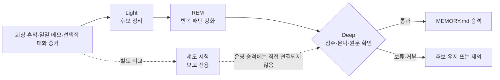

# 5장. 2026년 4월: 점수화된 성찰과 경계가 있는 에이전트형 회상

3월까지 OpenClaw는 기억을 저장하고 검색할 엔진과 그 엔진을 맡을 플러그인 경계를 갖췄다. 그러나 검색 도구가 있다는 사실만으로 기억이 실제 답변에 쓰이는 것은 아니었다. 주 모델이 도구를 호출하지 않으면 관련 기억은 그대로 묻혔고, 수많은 작업 메모 가운데 무엇을 장기 기억으로 올릴지도 여전히 사람과 프롬프트의 판단에 달려 있었다.

4월의 변화는 이 두 판단을 실행 가능한 단계로 옮겼다. Dreaming은 실제 회상 흔적을 관찰해 장기 승격 후보를 점수화했고, Active Memory는 주 모델이 답하기 전에 검색 전용 보조 에이전트를 실행했다. 새 세션의 시작 기억은 모델이 알아서 읽을 때까지 기다리지 않고 런타임이 직접 넣었다. 여기서 **에이전트형 회상**이란 고정 검색어를 곧바로 실행하는 대신, 도구와 출력이 제한된 별도 에이전트가 현재 요청에 필요한 검색을 판단하고 수행하는 방식을 뜻한다.

이 변화로 회상과 승격은 관찰하고 조정할 수 있는 제품 동작이 되었다. 동시에 점수가 실제 진실이나 권한을 보장하지 않는다는 한계, 자주 노출된 기억이 더 유리해지는 편향, 답변 전 검색의 지연, 대화 기록의 프라이버시라는 새 비용도 드러났다. 따라서 4월의 핵심은 “더 많이 기억하기”보다 **어느 단계가 무엇을 읽고, 어떤 근거로 결과를 다음 단계에 넘기는지 경계를 세운 일**에 있다.

[← 이전: 2026년 3월](04-march-2026.md) · [목차](README.md) · [다음: 2026년 5월과 6월 →](06-may-june-2026.md)

## 반복해서 쓰인 작업 기억을 승격하는 Dreaming

**Dreaming**은 짧게 쓰고 버릴 수 있는 작업 기억을 검토해, 오래 보존할 후보를 고르는 선택형 메모리 정리 과정이다. 여기서 **승격**은 후보 내용을 확인하고 다듬어 장기 기억 파일 `MEMORY.md`로 옮기는 일을 말한다. Dreaming은 무엇이 진실인지 직접 판정하는 대신, 검색 결과가 실제로 얼마나 자주 그리고 얼마나 다양한 질의에 쓰였는지를 관찰 가능한 대리 신호로 삼았다.

[PR #60569](https://github.com/openclaw/openclaw/pull/60569)는 2026-04-04에 [`4c1022c73b39`](https://github.com/openclaw/openclaw/commit/4c1022c73b3910ed68d0c4c72767e7465067c6a7)로 병합되었고 `v2026.4.5`에 처음 포함되었다. 첫 구현의 흐름은 다음과 같았다.

1. 자격을 갖춘 검색이 일어나면 어떤 내용이 어떤 질의에서 회상되었는지 관찰 기록을 남긴다.
2. 관련성, 회상 빈도, 질의 다양성, 최신성을 바탕으로 후보 점수를 계산한다.
3. 기본적으로 점수 `0.75`, 최소 3회 회상, 서로 다른 질의 최소 2개라는 문턱을 모두 넘은 후보만 승격 대상으로 삼는다.
4. 사용자가 `memory promote`를 실행하거나 선택형 예약 Dreaming이 돌 때 후보를 검토해 장기 기억으로 정리한다.

이 점수는 기억의 품질을 직접 측정한 절대값이 아니다. 여러 후보를 비교하고 승격 검토를 시작할지를 정하는 **운영 신호**다. 같은 버전이 출시되기 전 [`0609bf858175`](https://github.com/openclaw/openclaw/commit/0609bf858175818b79dba514cc3b10e744d5fa72)는 기존 네 요인에 여러 기록을 한데 묶을 가치와 개념적 가치를 더하고 가중치를 조정했다. 따라서 첫 커밋은 회상 주도 승격의 뼈대를 세웠고, 후속 커밋은 `v2026.4.5`에서 볼 수 있는 6요인 점수기를 완성했다고 구분해야 한다.

> **후속 변화의 동기.** 이 변경은 사용자 장애에 대한 수정이라기보다 출시 전 설계 보강에 가깝다. 커밋 제목과 변경 묶음은 Dreaming의 실행 이력을 점검하는 감사·수리 흐름을 강화하고, 여러 언어로 쓰인 개념 후보를 판별할 어휘를 보태려는 목표를 **명시적으로** 밝힌다. 그러나 각 요인의 가중치를 왜 그 수치로 정했는지는 설명하지 않는다. 따라서 여러 기록을 한데 묶을 가치와 개념 가치가 점수 요인에 추가되고 다국어 후보를 다루기 쉬워졌다는 사실은 확인할 수 있지만, 특정 사용자 보고가 점수 조정을 촉발했다고 단정할 수는 없다.

2026-01-02에 열린 [Issue #102](https://github.com/openclaw/openclaw/issues/102)는 벡터 기반 회상과 일일 기록의 장기 승격을 함께 요청했다. 1월의 하트비트 지침도 일일 기록을 검토해 장기 기억으로 정리하도록 했다. Dreaming은 이와 비슷한 승격 문제를 관측된 회상 점수, 명시적 문턱, 수동·예약 실행으로 다뤘다. 다만 기본적으로 꺼져 있는 선택 기능이므로 하트비트 정제를 대체하지는 않았다.

> **변화의 동기.** PR #60569에는 회상 관찰, 가중 신호, 초기 문턱, 수동·예약 승격이라는 **명시된 기능 목표와 계약**이 남아 있다. 반면 빈도·질의 다양성·최신성을 특정 가중치로 조합한 이유는 문서화되지 않아 **코드에서 추론**할 수 있을 뿐이다. Issue #102와 Hindsight는 검색과 장기 승격이라는 같은 문제를 먼저 보여 주는 **맥락적 증거**다. Dreaming PR과 코드가 Hindsight를 인용하지 않으므로, Hindsight가 4월의 알고리즘을 직접 결정했다고 연결해서는 안 된다.

### Light, REM, Deep은 하나의 정리 순회다

운영과 검토 범위가 넓어지면서 Dreaming에는 Light, REM, Deep이라는 내부 단계가 생겼다. 이 이름은 사용자가 고르는 세 가지 독립 모드가 아니다. 한 번의 Dreaming 정리 순회가 **Light → REM → Deep** 순서로 후보를 좁히는 구조다. 기존 자료에서 근거를 다시 채우는 작업, 사람이 읽는 꿈 일지, 운영에 영향을 주지 않는 섀도 시험, 메모리 사건을 기록하는 저널 연결부도 뒤따랐다. 여기서 사건 저널은 회상·단계 실행·승격 같은 변화를 나중에 추적할 수 있도록 남기는 기계 기록의 접점이다.

각 단계의 역할은 다음처럼 나뉜다.

| 단계                         | 무엇을 읽는가                                                               | 사람이 확인하는 결과                                                                         | 장기 기억에 미치는 영향                                                    |
| ---------------------------- | --------------------------------------------------------------------------- | -------------------------------------------------------------------------------------------- | -------------------------------------------------------------------------- |
| Light                        | 최근 회상 흔적, 일일 메모리, 사용할 수 있을 때 패턴으로 가린 대화 기록 증거 | 일일 파일의 관리 블록, `memory/dreaming/light/` 보고서, 선택적 `DREAMS.md` 일지              | 후보를 정리하고 강화 신호를 남기지만 `MEMORY.md`를 직접 바꾸지는 않는다.   |
| REM                          | Light가 고른 후보, 후보가 없으면 최근 회상 흔적                             | 반복 주제와 가능한 장기 사실을 담은 관리 블록, `memory/dreaming/rem/` 보고서, 선택적 꿈 일지 | 반복 패턴을 후보 신호로 남기지만 `MEMORY.md`를 직접 바꾸지는 않는다.       |
| Deep                         | 단기 후보, 6요인 점수, Light·REM 강화 신호, 승격 문턱                       | `DREAMS.md`의 Deep 요약과 선택적 `memory/dreaming/deep/` 보고서                              | 자격을 모두 통과하고 원문에서 다시 확인한 후보만 `MEMORY.md`에 쓸 수 있다. |
| 섀도 시험(세 단계 밖의 검토) | 후보 기억을 쓰지 않은 기준 답변과 후보 기억을 허용한 답변                   | `memory/dreaming/shadow-trials/`의 도움됨·중립·해로움 판정과 근거                            | `promote`·`defer`·`reject` 표지는 권고일 뿐 운영 승격을 실행하지 않는다.   |

Light·REM·Deep의 단계 신호와 진행 상태는 `memory-core`의 에이전트별 SQLite 상태가 관리한다. 반면 섀도 시험은 후보 정책을 실제 사용자 동작에 적용하지 않고 비교만 하는 **보고 전용 평가**이며, 보고서 파일이 그 결과를 담는다. 따라서 “보고서에 후보가 나타남”, “Deep 순위에 신호가 더해짐”, “`MEMORY.md`가 실제로 바뀜”은 서로 다른 사건이다.

[PR #70737](https://github.com/openclaw/openclaw/pull/70737)은 나중에 관리형 Dreaming 예약 작업을 하트비트 일정에서 분리했다. 이전에는 기본 에이전트의 하트비트가 꺼져 있으면 Dreaming도 실행되지 않았다. 변경 뒤에는 격리된 에이전트 실행과 Dreaming 전용 일정이 이 선택 기능의 수명주기를 맡았다.

> **변화의 동기.** 유지보수자 요청과 수명주기 장애에서 나온 **명시적 증거**다. PR #70737은 하트비트 비활성화가 Dreaming까지 멈추게 하는 결합을 직접 지목했다. 하트비트 설정에 예외를 더하는 대신 전용 관리 일정으로 옮겨, Dreaming의 실행 여부를 Dreaming 소유자가 독립적으로 통제하게 했다.

### 검색할 수 있는 자료와 승격할 수 있는 자료는 다르다

Dreaming이 대화 기록을 다루는 경계는 보호된 메모리 검색의 경계와 같지 않다. 대화 기록 수집을 따로 켜는 토글도 없다. Dreaming이 활성화된 상태에서 Light나 REM이 실행되면, 해당 단계는 워크스페이스에 연결된 에이전트의 대화 기록 모음, 즉 **대화 기록 코퍼스**를 수집할 수 있다. 수집한 내용은 정해진 패턴으로 민감한 문자열을 가린 뒤 `memory/.dreams/session-corpus/`에 증거 파일로 남고 단기 승격 후보의 근거가 될 수 있다. 이 동작은 [Light 호출](https://github.com/openclaw/openclaw/blob/a115af277410a91fb039d2ed699eafad706f5c73/extensions/memory-core/src/dreaming-phases.ts#L1681-L1715), [REM 호출](https://github.com/openclaw/openclaw/blob/a115af277410a91fb039d2ed699eafad706f5c73/extensions/memory-core/src/dreaming-phases.ts#L1790-L1820), [승격 소비](https://github.com/openclaw/openclaw/blob/a115af277410a91fb039d2ed699eafad706f5c73/extensions/memory-core/src/short-term-promotion.ts#L1832-L1874)에서 확인된다.

문자열을 가리는 처리는 노출될 내용을 줄이는 장치이지, 어느 대화에 접근해도 되는지를 판정하는 권한 검사가 아니다. Dreaming의 수집 경로는 보호된 `memory_search`가 사용하는 대화 종류·비공개 범위 필터를 그대로 재사용하지 않는다. 그러므로 검색 결과로 반환할 자격과 Dreaming이 수집·승격 근거로 사용할 자격을 같은 경계로 이해하면 안 된다.

점 하나 차이인 두 경로도 역할이 다르다.

| 경로                             | 담는 내용                                    | 일반 메모리 검색                                                             | 장기 승격 입력                                               | 프라이버시와 현재 상태                                                                                       |
| -------------------------------- | -------------------------------------------- | ---------------------------------------------------------------------------- | ------------------------------------------------------------ | ------------------------------------------------------------------------------------------------------------ |
| `memory/.dreams/session-corpus/` | 패턴으로 가린 대화 기록 증거(`.txt`)         | 내장 Markdown 스캐너의 대상이 아니며 Dreaming이 직접 읽는다.                 | 단기 후보의 근거가 될 수 있다.                               | 보호된 대화 검색의 권한 필터를 재사용하지 않는다. 현재 증거 산출물이며, 옛 `.dreams/*.json` 상태와는 다르다. |
| `memory/dreaming/`               | Light·REM·Deep의 사람이 읽는 Markdown 보고서 | `memory/` 아래의 검색 자격이 있는 Markdown이므로 일반 검색에 들어갈 수 있다. | 보고서가 자기 점수를 키우지 않도록 승격 입력에서는 제외된다. | 일반 Markdown으로 취급된다. 지금도 생성될 수 있는 보고 산출물이다.                                           |

두 경로를 포함한 전체 산출물은 다음 지도처럼 읽을 수 있다.

| 위치                                                   | 무엇을 담는가                                           | 현재 의미                                                                                                        |
| ------------------------------------------------------ | ------------------------------------------------------- | ---------------------------------------------------------------------------------------------------------------- |
| 에이전트별 SQLite 플러그인 상태                        | 회상 관찰, 단계 신호, 수집 체크포인트, 잠금과 진행 정보 | 현재의 기계 상태다. 과거 `.dreams/*.json`은 진단·수리 명령인 `doctor`가 옮길 입력이지 정상 런타임 원본이 아니다. |
| `memory/.dreams/session-corpus/`                       | 패턴으로 가린 대화 기록 증거 파일                       | Light·REM과 단기 후보 처리가 쓰는 증거다. 일반 Markdown 검색 경로는 아니다.                                      |
| `memory/YYYY-MM-DD.md` 또는 `memory/dreaming/<phase>/` | Light·REM 관리 블록과 설정에 따른 단계 보고서           | 사람이 검토할 수 있다. 단계 보고서는 검색될 수 있지만 승격 입력에서는 제외된다.                                  |
| `DREAMS.md`                                            | 사람이 읽는 꿈 일지와 Deep 실행 요약                    | 검토용 산출물이며 장기 의미 메모리 원본이나 승격 입력이 아니다.                                                  |
| `memory/dreaming/shadow-trials/`                       | 후보 정책의 도움됨·중립·해로움 판정과 근거              | 보고 전용이며 운영 승격을 실행하지 않는다.                                                                       |
| `MEMORY.md`                                            | 실제로 승격된 장기 기억                                 | Deep이 자격과 원문을 확인한 뒤 의미 원본을 바꿀 수 있는 최종 목적지다.                                           |

### 점수에는 노출 편향이 남는다

회상 점수는 승격을 관찰 가능한 과정으로 만들었지만, 기억의 품질을 독립적으로 측정하지는 않는다. **노출 편향**은 현재 순위 결정기가 상위에 보여 준 기억만 다음 평가 기회를 얻는 현상이다. 상위에 자주 노출된 기억은 회상 횟수와 질의 다양성 점수를 더 쉽게 쌓고, 그 점수가 다시 다음 노출과 승격 가능성을 높인다. 질의 다양성은 한 질의를 반복한 효과를 줄일 뿐 이 순환 자체를 없애지는 못한다.

점수가 높아도 그 내용이 사실인지, 지금도 유효한지, 현재 행동의 권한을 부여하는지는 별도 문제다. Dreaming 점수는 “검색 과정에서 반복해서 유용해 보였다”는 신호이지 진실성·최신성·권한에 대한 증명서가 아니다.

> **예시 — 합성 사례:** 두 메모의 실제 유용성이 같아도 검색 순위를 정하는 구성 요소가 A를 늘 위에 놓으면 A만 회상 횟수와 질의 다양성을 축적할 수 있다. 이는 노출 편향을 설명하기 위한 가상 예시이며, 관측된 OpenClaw 사례가 아니다.

섀도 평가의 경계도 구현 과정에서 정리되었다. [`b2f71db7bb46`](https://github.com/openclaw/openclaw/commit/b2f71db7bb46eda5a45fe932b014046574f3b44a)는 보고 전용 시험을 추가했다. [`70c59f59b258`](https://github.com/openclaw/openclaw/commit/70c59f59b25839038a968e75c5c99379e45ca13b)은 도움됨·중립·해로움 판정으로 보고서 안의 후보 점수와 순위를 계산하는 보조 함수를 더했다. 그러나 반환값은 처음부터 `scoringAction: "report-only"`였고 실제 운영 승격 호출 경로에는 연결되지 않았다. [`7679872ddf3d`](https://github.com/openclaw/openclaw/commit/7679872ddf3db5cff42f14fc9f839eff73b3376b)은 이 사용되지 않는 점수 보조 연결부를 제거했다. 현재는 보고 실행기만 남아 있으며 운영 승격은 섀도 판정을 사용하지 않는다.

> **변화의 동기.** 보고 전용 실험 경계를 정리한 **명시적 근거와 코드 추론**이다. `70c59f59b258`의 커밋 본문과 타입은 점수 계산도 보고 전용이라고 명시하고, `7679872ddf3d`는 호출자가 없는 보조 코드를 제거한다. 확인할 수 있는 역사는 검토용 점수 실험과 사용되지 않는 코드의 정리까지다. 운영 승격 정책이 한동안 바뀌었다가 되돌아갔다고 서술할 근거는 없으며, 실제 호출자 없이 보조 함수가 추가된 이유도 남은 자료만으로는 알 수 없다.

## 구조화된 주장을 다루는 Memory Wiki

평면 Markdown은 짧은 사실과 선호를 기록하기에는 편하지만, 오래 유지할 주장의 출처·관계·모순을 체계적으로 표현하기에는 부족하다. **Memory Wiki**는 이 문제를 다루는 선택형 구조화 지식 계층이다. 모든 기억에 새 형식을 강제하는 대신 별도의 **볼트**, 즉 관련 원본과 파생 페이지를 모아 관리하는 저장 영역을 두었다.

Memory Wiki는 자료 수집, 페이지 컴파일, 검사, 출처 보존, 백링크, 모순 중심 이슈, 통제된 변경, 가져오기 동기화, 공유 회상 연결부를 제공했다. 여기서 **컴파일**은 원본 자료를 읽어 검색·탐색하기 쉬운 위키 페이지로 다시 구성하는 과정이고, **백링크**는 현재 페이지를 가리키는 다른 페이지를 역으로 보여 주는 연결이다. 시작점은 [`57d1685a65f5`](https://github.com/openclaw/openclaw/commit/57d1685a65f59a808305ec7fb708269d2031616b)다.

이 선택은 2025년 제안이 예견한 구조화 지식의 필요에 답하면서도 평면 Markdown을 대체하지 않았다. 짧은 메모는 계속 낮은 비용으로 작성할 수 있었지만, 선택형 볼트에는 별도의 스키마와 컴파일 산출물을 관리하는 비용이 생겼다.

초기의 LLM 기반 스택은 같은 날 [`94256ea1a076`](https://github.com/openclaw/openclaw/commit/94256ea1a07689d7c3bf8791a3d1271019ba6852)에서 되돌려졌다. 원래 커밋은 `v2026.4.5`의 조상이지만 그 출시 트리에는 Memory Wiki 기능이 없다. [`5716d83336fd`](https://github.com/openclaw/openclaw/commit/5716d83336fd3411ba515659af4879ae8518563f)은 경계를 좁힌 형태로 기능을 복원했고, 실제 기능이 들어간 첫 태그는 `v2026.4.7`이다. 복원된 플러그인은 컴파일된 페이지를 출처와 사람이 작성한 블록을 보존한 **파생 산출물**로 다뤘다. 위키 페이지 자체를 새로운 최종 원본으로 선언한 것은 아니다.

> **변화의 동기.** 설계·소유권 정리에서 **코드로 추론한 증거**다. 추가·되돌림·복원 순서는 구조화 지식의 비용을 모든 평면 기억에 강제하지 않고 선택형 플러그인 안에 가두려는 방향을 보여 준다. 다만 복원 커밋은 경계를 좁힌 이유를 상세히 설명하지 않는다. 따라서 되돌림이 특정 장애 때문에 일어났다고 단정할 수 없다. 출처를 보존한 파생 페이지라는 형태는 사람이 관리하는 원본과 탐색용 구조를 분리하려는 선택으로 읽을 수 있다.

## 답변 전에 제한적으로 검색하는 Active Memory

주 모델에게 메모리 도구를 제공해도 매번 필요한 검색을 수행한다는 보장은 없었다. **Active Memory**는 이 누락을 줄이기 위해, 주 모델의 답변 전에 검색 전용 보조 에이전트를 한 번 실행하는 선택 기능이다. “능동적”이라는 말은 백그라운드에서 계속 생각하거나 기억을 새로 저장한다는 뜻이 아니다. 현재 사용자 요청을 보고 필요한 검색어와 메모리 도구 호출을 제한된 범위에서 고른다는 뜻이다.

이 보조 에이전트는 일반 셸·파일·메시지 도구를 쓰는 자유로운 하위 작업자가 아니다. 허용된 메모리 도구로만 검색하고, 관련 내용이 있을 때 짧은 요약을 돌려준다. 런타임은 그 요약을 사용자가 보낸 새 메시지가 아니라 신뢰할 수 없는 숨은 보조 컨텍스트로 주 모델 프롬프트에 넣는다. 따라서 **검색 실행**, **관련성 요약**, **최종 답변**은 서로 다른 단계다.

Active Memory를 도입한 [PR #63286](https://github.com/openclaw/openclaw/pull/63286)은 [`b83726d13e33`](https://github.com/openclaw/openclaw/commit/b83726d13e336643d0b68d8aae79f222b8d26e90)으로 병합되어 `v2026.4.10`에 처음 포함되었다. 이로써 회상은 프롬프트 속 권고에서 명시적인 답변 전 런타임 단계로 이동했다.

> **변화의 동기.** 유지보수자 제품 요청에서 나온 **명시적 증거**다. PR #63286은 사용자가 검색을 따로 요구하지 않아도 선호·습관·개인 사실을 선제적으로 떠올리게 하려는 목표를 직접 밝혔다. 주 모델의 지침만 더 강하게 쓰는 대신 도구가 제한된 별도 에이전트가 검색하고 압축된 관련 내용만 넘기도록 해, 회상 여부를 독립된 실행 단계로 만들었다.

### 선제 회상에는 답변 전 지연이 따른다

Active Memory는 주 답변보다 먼저 실행되므로 검색 시간이 그대로 첫 응답 지연에 더해질 수 있다. 특히 [QMD](01-current-architecture.md#qmd-explained)는 별도 프로세스로 실행되는 로컬 검색 백엔드이므로, 여러 에이전트가 있는 게이트웨이 시작 시 초기화 요청이 한꺼번에 몰릴 수 있다. [Issue #72015](https://github.com/openclaw/openclaw/issues/72015)은 이 시작 시점의 요청 집중을 보고했다. 현재 코드는 실행 가능 여부를 먼저 검사하고, 별도의 시간 제한과 출력 상한을 적용하며, 검색이 실패하거나 아무 결과가 없어도 주 답변을 계속하는 **실패 시 계속 진행 방식**을 사용한다. 이 책의 기준일인 2026-07-18에도 이 이슈는 열려 있었다.

전경 지연을 줄이기 위해 Active Memory의 QMD 경로는 여러 검색과 재순위화를 거치는 전체 `query` 파이프라인 대신 단어 중심의 `search`를 기본값으로 사용하게 되었다. [Issue #64829](https://github.com/openclaw/openclaw/issues/64829)은 당시 `query`가 약 4초, `search`가 약 0.2초 걸렸고 Active Memory의 두 차례 모델 실행까지 합치면 첫 답변이 20~25초로 늘어난 사례를 제시했다. 이 이슈를 직접 참조한 [PR #65068](https://github.com/openclaw/openclaw/pull/65068)은 `search`를 기본으로 바꾸되 설정으로 더 비싼 경로를 다시 선택할 수 있게 했다.

> **변화의 동기.** 사용자 운영 측정과 유지보수자 제품 판단에서 나온 **명시적 증거**다. Issue #64829의 지연 수치와 PR #65068의 직접 참조가 원인과 변경을 잇는다. 전체 질의 파이프라인을 제거하지 않고 명시적 재정의를 남긴 것은, 대화형 기본 경로의 응답성과 더 정교한 재순위화가 필요한 설치의 선택권을 함께 보존하기 위해서다. 오프라인 검색 품질이 가장 높은 경로가 답변 전 실행에도 자동으로 최선인 것은 아니다.

따라서 Active Memory는 회상률만으로 평가할 수 없다. 실제로 도움이 된 회상의 비율, 추가된 지연, 검색했지만 넘길 내용이 없었던 실행 비율, 사용자가 체감한 답변 품질을 함께 보아야 한다.

## 시작 기억을 런타임이 직접 주입하다

내용 없는 `/new`나 `/reset`의 첫 답변에서도 모델이 시작 파일을 스스로 발견하고 읽으리라고 기대할 수 없었다. 이를 해결한 **부트스트랩 주입**은 첫 모델 호출 전에 런타임이 시작에 필요한 기억을 골라 초기 컨텍스트에 넣는 동작이다. 런타임은 설정된 시간대의 달력 날짜를 기준으로 오늘과 어제의 일일 메모를 선택하고, 크기를 제한한 뒤, 신뢰할 수 없는 컨텍스트임을 표시한 인용 블록으로 감쌌다.

[PR #65055](https://github.com/openclaw/openclaw/pull/65055)는 [`94340b959830`](https://github.com/openclaw/openclaw/commit/94340b959830b8d7dd70d486617963ad2999409c)으로 병합되어 `v2026.4.12-beta.1`에 처음 포함되었다. 이 변경으로 “시작 파일을 찾아 읽으라”는 모델 지침이 재현 가능한 런타임 동작으로 바뀌었다. 주입은 새 세션의 첫 응답에 한 번만 일어나므로 이후 대화마다 같은 메모를 반복해서 넣지는 않는다.

더 일찍 제기된 [Issue #48217](https://github.com/openclaw/openclaw/issues/48217)은 같은 종류의 시작 실패를 설명한다. 그러나 PR #65055는 이 이슈를 연결하지 않으므로 직접 원인이 아니라 **맥락적 증거**로만 다룬다.

> **변화의 동기.** 유지보수자 요청에서 나온 **명시적 증거**다. PR #65055는 비어 있는 `/new`와 `/reset`이 모델의 자율적인 시작 절차에 의존하던 문제를 직접 설명했다. 달력 날짜와 시간대를 런타임이 적용하고 시작 컨텍스트를 한 번만 앞에 붙이는 방식은 첫 응답의 재현성을 확보하면서 반복 주입 비용을 피하기 위한 선택이었다. Issue #48217은 같은 실패 형태를 보여 주지만 PR과 직접 연결되지 않은 **맥락적 증거**다.

## 루트 파일과 임베딩 공급자의 소유권을 좁히다

회상 경로를 결정적으로 만들려면 어떤 파일과 공급자가 정식 소유자인지도 하나로 모아야 했다. 임베딩 구현은 공급자 플러그인으로 이동했고, 런타임이 워크스페이스 최상위에서 찾는 장기 기억은 대문자 `MEMORY.md`로 제한되었다. 소문자 `memory.md`만 있으면 정상 런타임은 더 이상 이를 읽지 않았다. 대신 진단·수리 명령인 `doctor`가 대소문자 차이로 갈라진 일부 과거 상태를 좁은 범위에서 병합하도록 했다.

근거는 임베딩 구현을 옮긴 [`77e6e4cf87f7`](https://github.com/openclaw/openclaw/commit/77e6e4cf87f7a0b6343b48328050e0f31a282117), 대문자 루트만 읽도록 한 [`10a9acbf2936`](https://github.com/openclaw/openclaw/commit/10a9acbf29361744ff8a9920cc07c7d285e831bd), 정책과 복구 경계를 중앙화한 [`deb1364dfbe6`](https://github.com/openclaw/openclaw/commit/deb1364dfbe6e4561f1d6f388a837832186b3c7f)이다. 세 변경은 임베딩 공급자, 정식 루트 파일명, 과거 상태 복구의 책임을 각각 한곳에 모았다.

> **변화의 동기.** 설계·소유권 정리에서 **코드로 추론한 증거**다. 세 커밋은 각 정책을 한 소유자에게 모은 사실을 보여 주지만, 하나의 공통 사건이 세 변경을 일으켰다고 명시하지는 않는다. 정상 런타임은 정식 대문자 파일만 읽고 과거 충돌은 `doctor`가 수리하도록 해, 계속 실행되는 경로에 영구적인 호환 분기를 남기지 않았다.

## 규모와 대화 기록 프라이버시를 측정 가능한 문제로 만들다

회상 빈도가 늘면서 검색 속도와 결과 공개 범위가 함께 중요해졌다. 먼저 성능 측면에서는 검색 대상 문서 조각인 **청크**가 10,827개인 코퍼스에서 JavaScript 전체 벡터 스캔이 약 8.5초, `sqlite-vec`의 KNN 후보 조회가 약 50 ms 걸렸다. **KNN 후보 조회**는 질의 벡터와 가까운 일부 항목만 데이터베이스에서 먼저 고르는 방식이다.

[PR #69680](https://github.com/openclaw/openclaw/pull/69680)은 KNN으로 후보 수를 줄인 뒤에도 기존 코사인 유사도로 다시 점수를 매겼다. 따라서 속도 최적화가 이미 사용하던 점수 의미와 순위를 몰래 바꾸지 않았다.

> **변화의 동기.** 운영 측정에서 나온 **명시적 증거**다. PR #69680은 10,827개 청크에서 전체 스캔과 KNN 후보 조회의 지연 차이를 직접 제시했다. 네이티브 KNN으로 후보를 먼저 줄이고 기존 코사인 재점수화를 유지한 것은 속도를 얻으면서 이미 노출된 순위 계약을 보존하기 위해서다.

더 중요한 경계는 대화 기록의 프라이버시였다. 인덱스에 결과가 있다는 사실이 현재 에이전트와 대화에서 그 내용을 볼 권한까지 뜻하지는 않는다. [PR #70761](https://github.com/openclaw/openclaw/pull/70761)은 [`2c716f5677de`](https://github.com/openclaw/openclaw/commit/2c716f5677de4db99ecaab058b4f375009468c86)로 병합되어 `v2026.4.24-beta.1`에 처음 포함되었다. 이 변경은 백엔드가 반환한 대화 기록 결과에 **검색 후 프라이버시 필터**를 적용했다. 검색 후 필터란 결과를 먼저 받은 다음, 현재 세션과 에이전트의 가시성 규칙에 맞지 않는 항목을 사용자에게 보여 주거나 인용하고 회상 관찰로 기록하기 전에 버리는 검사다. 판단이 불확실하면 결과를 허용하지 않는다.

검색할 원본을 고르는 단계와 개별 결과의 가시성을 검사하는 단계는 순서가 다르다. 명시적인 `corpus=sessions` 또는 `corpus=memory` 요청은 백엔드가 어느 원본을 검색할지 순위화와 상위 N개 선택 전에 제한한다. 그러나 세션별 프라이버시 필터는 백엔드가 `maxResults`만큼 결과를 반환한 뒤에 실행된다. 따라서 차단된 결과는 노출·인용·Dreaming 회상 신호가 될 수 없지만, 이미 결과 슬롯 하나를 차지해 사용자가 받는 항목 수를 줄일 수 있다. 이 순서는 현재의 [도구 실행 순서](https://github.com/openclaw/openclaw/blob/a115af277410a91fb039d2ed699eafad706f5c73/extensions/memory-core/src/tools.ts#L647-L759)에서도 확인된다.

> **변화의 동기.** 보안 경계에 대한 유지보수자 요청에서 나온 **명시적 증거**다. PR #70761은 인덱싱된 회상이 다른 세션 도구와 같은 가시성 규칙을 지켜야 한다고 명시했다. 반환 결과를 인용·노출·회상 관찰 전에 검사하는 공통 필터를 두어 여러 백엔드에 같은 정책을 적용했다. 다만 이는 결과 상한 뒤에 실행되는 검색 후 필터다. 백엔드 후보 선택 전부터 세션별 권한을 적용한다고 확대해서는 안 된다.

> **예시 — 합성 사례:** 백엔드가 `maxResults=3`으로 세 항목을 반환했고 첫 항목이 프라이버시 필터에서 차단되면 사용자는 최대 두 항목만 볼 수 있다. 차단된 항목은 인용이나 Dreaming 학습 신호가 되지 않지만, 백엔드의 상위 세 슬롯 가운데 하나는 이미 사용했다. 이는 실행 순서를 설명하는 가상 예시이지 실제 관측 기록이 아니다.

대화 기록의 **출처**도 정리해야 했다. 컴팩션 전에 기억할 내용을 파일에 쓰라고 모델에 알리는 내부 플러시 프롬프트가 일반 사용자 메시지로 저장되면, 나중의 검색은 런타임 지시를 사용자의 발화로 잘못 회상할 수 있다. [PR #73380](https://github.com/openclaw/openclaw/pull/73380)은 이 내부 프롬프트를 사용자 대화 기록에서 제외했다.

> **변화의 동기.** 장애·회귀 사건에서 나온 **명시적 증거**다. PR #73380은 Issue #54408과 중복 보고 #58956을 연결해, 컴팩션 전 플러시 프롬프트가 일반 사용자 메시지로 저장·투영되던 문제를 고쳤다. 특정 문구를 걸러 내기보다 내부 실행 또는 명시적 내부 출처로 구분해, 프롬프트 문장이 바뀌어도 런타임 지시와 사용자 발화를 혼동하지 않게 했다.

## 다음 장으로

4월에는 회상과 승격이 프롬프트의 재량에서 벗어나 관찰 가능한 런타임 단계가 되었다. Dreaming은 반복 회상을 장기 승격의 신호로 삼았고, Active Memory와 부트스트랩 주입은 필요한 기억이 답변 전에 도달할 경로를 만들었다. Memory Wiki는 출처와 모순을 다루는 선택형 구조화 계층을 제시했다. 동시에 점수는 진실이나 권한을 보장하지 않으며, 선제 회상에는 지연이 따르고, 대화 기록에는 검색 결과를 사용자에게 내보내기 전 별도의 가시성 검사가 필요하다는 한계도 분명해졌다.

이제 남은 질문은 세 가지였다. 검색된 과거 문장을 현재의 행동 권한으로 볼 수 있는가, 공급자와 인덱스의 정체성이 어긋났을 때 무엇을 믿어야 하는가, 늘어나는 기계 상태와 파생 인덱스를 누가 옮기고 복구해야 하는가. 5월과 6월에는 이 문제들이 권한 메타데이터, 진단 가능한 인덱스 정체성, 원자적 게시, 데이터베이스 우선 상태로 이어진다.

---

[← 이전: 2026년 3월](04-march-2026.md) · [목차](README.md) · [다음: 2026년 5월과 6월 →](06-may-june-2026.md)
