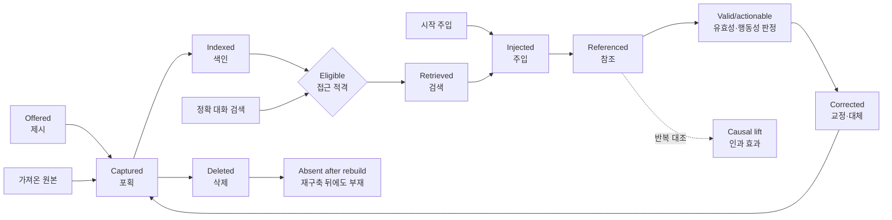

# 9장. 프로젝트 신호와 제안된 평가 전략

앞 장의 설계 원칙은 무엇을 지켜야 하는지 말해 주었다. 그러나 프롬프트보다 런타임 강제를, 부수 파일보다 SQLite를, 무제한 회상보다 범위 경계를 택했다는 사실만으로 그 선택이 실제 작업을 개선했는지는 알 수 없다. 이제 역사를 변화의 목록이 아니라 검증할 가설의 목록으로 다시 읽어야 한다.

OpenClaw에는 이미 버그 보고, QA 시나리오, 검색 진단, 인용, 회상 횟수, Dreaming 검토처럼 풍부한 신호가 있다. 부족한 것은 이 신호를 “정보가 제시됨”에서 “나중 작업의 결과”까지 이어 주는 분기형 결과 추적 체계다. 저장, 색인, 범위 판정, 검색, 주입, 참조 가운데 어디에서 결과가 갈렸는지를 구분해야 각각에 맞는 수정을 고를 수 있다.

이 장은 먼저 2026-07-18까지 확인된 신호를 현재의 증거로 정리한 뒤, 그 증거에서 평가 설계를 끌어낸다. 뒤에 나오는 추적 단계, 지표, SLO, 실험 순서는 모두 이 책이 검토하는 제안이며, OpenClaw가 이미 채택했거나 보장하는 제품 계약이 아니다.

[← 이전: 설계 전환과 제안 재검토](08-design-turns-and-proposal-review.md) · [목차](README.md) · [다음: 현재 계약의 간극 →](10-current-contract-gaps.md)

## 이미 드러난 변화 신호를 장부로 읽기

기억 시스템의 역사는 단순한 기능 목록보다 “어떤 실패가 무엇을 드러냈고, 프로젝트가 어떻게 반응했는가”로 읽을 때 더 선명해진다. 다음 장부는 현재인 2026-07-18까지 확인된 신호, 당시의 대응, 아직 답하지 못한 질문을 한 줄로 연결한다. 왼쪽에서 오른쪽으로 읽으면 개별 사건이 설계 교훈을 거쳐 아직 검증하지 못한 주장으로 바뀌는 과정을 볼 수 있다.

| 신호                                                                                                                                 | 드러난 사실                                                             | 프로젝트의 대응                                                                                             | 남은 질문                                                                                                             |
| ------------------------------------------------------------------------------------------------------------------------------------ | ----------------------------------------------------------------------- | ----------------------------------------------------------------------------------------------------------- | --------------------------------------------------------------------------------------------------------------------- |
| [이슈 #102](https://github.com/openclaw/openclaw/issues/102): 벡터 회상과 일일 기록의 장기 기억 승격                                 | Markdown만으로는 규모를 감당하기 어렵고, 보존과 통합은 서로 다른 문제다 | 1월의 벡터 검색과 하트비트 큐레이션, 4월의 점수화·예약형 Dreaming                                           | 승격이 미래 작업 결과를 실제로 개선하는가, 아니면 현재 랭커가 이미 노출한 항목을 증폭하는가?                          |
| [이슈 #6877](https://github.com/openclaw/openclaw/issues/6877): flush가 일일 파일을 덮어씀                                           | 자연어로 지시한 쓰기 프로토콜은 기존 기억을 파괴할 수 있다              | [PR #6878](https://github.com/openclaw/openclaw/pull/6878)에서 먼저 읽고 append하도록 프롬프트 수정         | append-only를 프롬프트가 아니라 아티팩트나 도구 계층에서 강제할 수 있는가?                                            |
| [이슈 #20730](https://github.com/openclaw/openclaw/issues/20730): CJK에서 BM25 실패                                                  | 영어 중심 집계 테스트가 언어권 전체의 회상 실패를 가렸다                | trigram 토크나이저, 짧은 질의 폴백, 재색인 식별 정보                                                        | 현실적인 검색 구간이 아직 부족한 문자 체계와 언어는 무엇인가?                                                         |
| [이슈 #25202](https://github.com/openclaw/openclaw/issues/25202): LanceDB가 포획했지만 회상하지 않아 고장처럼 보임                   | 저장되었다고 해서 기억되는 것은 아니다                                  | 자동 회상의 의미와 문서를 점차 개선                                                                         | 모든 메모리 플러그인이 포획·회상 기본값을 일관되게 공개하는가?                                                        |
| [이슈 #16670](https://github.com/openclaw/openclaw/issues/16670): 설정 후 메모리가 고장처럼 보임                                     | 공급자 온보딩과 상태 진단도 체감 메모리 품질의 일부다                   | FTS 폴백, 공급자 `none`, 진단·상태 기능 강화                                                                | “파일은 있음 / 인덱스가 오래됨 / 공급자 사용 불가 / 허용된 결과 없음”을 하나의 추적으로 설명할 수 있는가?             |
| [이슈 #48217](https://github.com/openclaw/openclaw/issues/48217): `/new` 이후 기억상실처럼 보임                                      | 시작 시 기억 로딩이 모델 행동에 지나치게 의존했다                       | 같은 실패 형태와 정렬되는 런타임 날짜별 노트 주입. 직접 인과는 입증되지 않음                                | 이용 가능한 기억이 있는데도 차가운 첫 응답이 틀리는 비율은 얼마인가?                                                  |
| [이슈 #45608](https://github.com/openclaw/openclaw/issues/45608): 재설정 전 에이전트식 플러시 부재                                   | 기계적 대화 기록 포획과 의미 통합은 같지 않다                           | 지금도 열려 있음                                                                                            | `/new`에 제한된 큐레이션을 넣어야 하는가? 지연과 데이터 손실의 균형은 어떻게 잡는가?                                  |
| [이슈 #72015](https://github.com/openclaw/openclaw/issues/72015): Active Memory/[QMD](01-current-architecture.md#qmd-explained) 지연 | 선제 회상은 응답성을 낮추고 초기화 부하를 키울 수 있다                  | 기한, 적격성, 실패 시 계속 동작을 추가했지만 이슈는 열려 있음                                               | 1밀리초 또는 한 번의 모델 호출당 얻는 효용은 얼마인가?                                                                |
| [이슈 #99611](https://github.com/openclaw/openclaw/issues/99611): 표면을 넘나들 때의 기억상실                                        | 개인 비서 식별 정보에 비해 세션 키가 지나치게 좁았다                    | 보호된 `rememberAcrossConversations`. `v2026.7.2-beta.3`에서 기능, `beta.4`에서 조건부 기본값 출시          | 열거한 모든 바인딩·DM 배치 적합성 사례에서 관찰된 교차 사용자 회상이 0이고, 식별 불가 대상은 계속 실패 시 차단되는가? |
| [이슈 #100978](https://github.com/openclaw/openclaw/issues/100978): 대화 기록 발견 수단 부재                                         | 의미 기억과 정확한 아카이브 조회는 서로 다른 일이다                     | FTS5 기반 `sessions_search`                                                                                 | 에이전트는 언제 대화 기록 검색을 쓰고 언제 장기 의미 메모리 검색을 써야 하는가?                                       |
| [이슈 #106215](https://github.com/openclaw/openclaw/issues/106215): 마이그레이션 마찰                                                | 메모리는 특정 하네스보다 오래가는 사용자 자산이다                       | Control UI, 로컬 CLI/macOS 온보딩, Linux 보조 앱에서 Control UI로 이어지는 안전한 공용 메모리 전용 가져오기 | 삭제·내보내기·중복 제거도 같은 수준으로 이식 가능한가?                                                                |
| [행동 민감 기억 지침](https://github.com/openclaw/openclaw/pull/82788)                                                               | 기억된 진술은 참이어도 행동 권한이 아닐 수 있다                         | 승인·만료·권한 문서화                                                                                       | 권한과 대체 관계를 구조적으로 표현하고 평가할 수 있는가?                                                              |

OpenClaw에는 이미 버그 보고, 파일 차이, QA 카나리아, 폴백 로그, 검색 진단, 인용, 회상 횟수, 사람의 Dreaming 검토가 있다. 신호가 없는 것이 아니다. 문제는 이 신호가 **정보가 제시된 순간**부터 **미래 작업 결과**까지 이어지는 관찰 가능한 사건 그래프로 결합되지 않았다는 데 있다.

이 그래프는 하나의 직선 깔때기여서는 안 된다. 가져오기는 `Captured` 단계에서 시작할 수 있고, 시작 시점 주입은 검색 질의를 건너뛸 수 있으며, 정확한 대화 기록 검색은 의미 색인을 우회한다. 미리 적재한 검색 벤치마크는 수명주기 포획 자체를 시험하지 않는다. 따라서 상관관계 ID는 실제로 존재하는 사건만 연결해야 하며, 모든 경로가 같은 단계를 밟는다고 암시해서는 안 된다. 그래프는 실패 위치를 찾게 해 주지만, 인과적 의존은 반복된 기준선·후보 대조 실험으로 따로 추정해야 한다.

이 장부가 가리키는 다음 과제는 새로운 기억 기능을 더하는 일이 아니라, 이미 있는 신호가 어느 결과로 이어졌는지를 같은 언어로 기록하는 일이다. 그래야 저장 성공을 회상 성공으로 오해하지 않고, 검색 성공을 유용한 행동의 증거로 과장하지 않을 수 있다. 여기서 시간축은 현재 상태의 설명에서 미래 평가 설계로 바뀐다. 이하의 계측, SLO, 벤치마크 순서, 우선순위 체계는 역사와 현재 간극에서 도출한 이 책의 권고안이며, OpenClaw가 이미 채택했거나 보장하는 동작으로 읽어서는 안 된다.

## 메모리 결과 추적부터 시작한다

평가용 말부터 일상어로 맞추자. **합성 평가 실행**은 실제 사적 대화 대신 정답과 허용 범위를 미리 정한 가짜 대화로 시스템을 시험하는 실행이다. **운영 환경 수집**은 실제 사용 중의 사건을 기록하는 일이므로 별도의 명시적 동의가 필요하다. **의미 산출물**은 사람이 나중에도 뜻을 알아볼 수 있는 메모리 기록이고, **수명주기 소유자**는 그 기록·색인·삭제 단계를 책임지는 런타임이나 플러그인이다. **평가 사례**(fixture)는 입력과 기대 결과를 묶은 시험 한 건이며, 그 기대 결과를 **정답 표지**(label)라고 부른다.

처음에는 합성 평가 실행과 사용자가 명시적으로 요청한 메모리 작업만 계측해야 한다. 임의의 사적 대화를 배경에서 훑어 “기억할 만한 내용”을 분류하는 방식으로 시작해서는 안 된다. 다음 표의 영어 이름은 앞으로 이벤트 스키마를 만든다면 쓸 수 있는 안정된 식별자이고, 본문의 설명은 한국어 이름을 먼저 쓴다.

| 한국어 단계        | 이벤트 식별자         | 관찰할 입력과 출력                                         | `ORBIT` 합성 예시                                   |
| ------------------ | --------------------- | ---------------------------------------------------------- | --------------------------------------------------- |
| 제시               | `Offered`             | 사용자 발화 → 오래 보존할 후보                             | “코드명은 `ORBIT-10`이야. 기억해 줘.”               |
| 포획               | `Captured`            | 후보 → 특정 의미 산출물의 새 내용 리비전                   | `memory/project.md`에 `ORBIT-10`이 추가됨           |
| 색인               | `Indexed`             | 내용 리비전 → 검색 가능한 인덱스 리비전                    | 새 청크가 현재 인덱스에 포함됨                      |
| 접근 적격 판정     | `Eligible for access` | 현재 에이전트·대화·질의 → 허용 또는 거부                   | 개인 대화는 허용하고 무관한 그룹 대화는 거부함      |
| 유효성·행동성 판정 | `Valid/actionable`    | 평가 정답 표지 → 현재 사실인지, 행동에 써도 되는지         | `ORBIT-9`는 폐기, `ORBIT-10`은 언급 가능            |
| 검색               | `Retrieved`           | 질의 → 순위·점수·인용 식별자가 붙은 후보                   | “현재 코드명?”에 새 값이 1위로 반환됨               |
| 주입               | `Injected`            | 검색 후보 → 주 모델이 실제로 받은 문맥                     | `ORBIT-10` 구절이 토큰 예산 안에 들어감             |
| 참조               | `Referenced`          | 모델 문맥 → 답변의 인용·복사·행동 연결                     | 답변이 “현재 코드명은 `ORBIT-10`”이라고 말함        |
| 교정               | `Corrected`           | 사용자 수정·거부 → 파일 편집, 되돌림, 대체 관계            | 사용자가 `ORBIT-11`로 바꾸어 이전 값을 대체함       |
| 삭제               | `Deleted`             | 삭제 요청 → 정본·파생·물질화 사본 처리와 검증 결과         | 재색인·재시작 뒤에도 `ORBIT-10`이 반환되지 않음     |
| 인과 효과          | `Causal lift`         | 반복 대조 실행 → 기억이 만든 개선·피해와 불확실성의 추정치 | 기억을 쓴 조건이 기준 조건보다 정답률을 높였는지 봄 |

이 추적이 있으면 “에이전트가 잊었다”를 하나의 모호한 실패로 취급하지 않아도 된다. 원인은 쓰기 부재, 오래된 인덱스, 범위(scope) 거부, 검색 누락, 순위 경쟁에서의 탈락, 문맥 잘림, 관찰 가능한 참조 부재, 낡은 내용, 삭제되지 않은 물질화 사본일 수 있다. 각각의 수정 방법은 다르다.

> **예시 — 합성 사례:** 사용자가 프로젝트 식별자를 `ORBIT-9`에서 `ORBIT-10`으로 정정했다고 하자. `ORBIT-10`이 파일에 써졌더라도 오래된 인덱스가 `ORBIT-9`만 반환하면 `Captured`는 성공하고 `Indexed`에서 실패한 것이다. 둘 다 검색되지만 오래된 값이 앞서면 `Retrieved`의 순위화 문제다. 새 값이 모델 문맥에 들어갔는데 답변이 옛 값을 쓰면 `Injected` 이후의 문제다. 이 예시는 단계 차이를 설명하기 위한 합성 사례다.

답변에 `ORBIT-10`이 나타났다는 사실은 **대리 지표**(proxy)다. 기억을 참조했을 가능성은 보여 주지만, 기억 때문에 답이 좋아졌다는 인과관계까지 증명하지는 않는다. 예를 들어 같은 평가 사례를 두 조건으로 반복한다. A 조건은 기억을 주지 않는 기준선이고, B 조건은 후보 기억을 주는 정책이다. 다른 조건을 같게 유지한 대응 표본 시험이나 무작위 대조 시험에서 B가 일관되게 더 정확하고 새 피해를 만들지 않을 때, 그 차이를 **인과 효과**(causal lift)로 추정할 수 있다. 한 번의 성공이나 단순한 동시 발생은 상관관계일 뿐이다.

## 신호마다 답할 수 있는 주장이 다르다

서로 다른 신호를 하나의 승격 단일값으로 압축하면 신호의 의미가 사라진다.

| 신호                               | 확립하는 것                              | 확립하지 못하는 것                                         |
| ---------------------------------- | ---------------------------------------- | ---------------------------------------------------------- |
| 명시적 “이것을 기억해”             | 포획 의도와 원하는 지속성                | 진실, 미래 효용, 행동 권한, 발화자·세션 밖으로 확장할 범위 |
| 명시적 “잊어/삭제해”               | 삭제와 미래의 비사용 의도                | 과거 진술이 거짓이었다는 사실                              |
| “그건 틀렸어”, 대체·철회·만료      | 해당 출처가 말하는 현재 교정·권한 상태   | 전역적 진실 또는 다른 사람·맥락으로 일반화할 권한          |
| 사람의 편집·되돌림·검토 승인       | 사람이 원하는 산출물 상태                | 미래 검색 효용                                             |
| 인용된 답변 뒤의 확인·교정         | 그 차례의 관련성과 작업 효용에 관한 증거 | 미래 작업 전반에 걸친 내구성 있는 중요도                   |
| 통제된 QA 또는 대응 표본 섀도 시험 | 열거된 평가 사례와 정책에서의 개선·피해  | 운영 환경 분포 전반의 개선                                 |

`memory_search` → `memory_get` → 인용된 답변, 의미가 다른 질의의 반복, 새 출처가 오래된 충돌을 해결한 경우, 유용·중립·유해 섀도 판정 같은 운영 순서는 유용한 대리 지표다. 단, 무엇의 대리 지표인지 축을 명명해야 한다. 검색 횟수, 순위·점수, 문맥에 머문 시간, 모델의 반복, 단 한 번 성공한 합성 질의만으로는 약한 증거다.

### 고급 실험에서만 선택 편향을 보정한다

현재 Dreaming의 승격 점수에는 회상 빈도가 일부 반영된다. 그러나 자주 검색된 항목은 처음부터 노출 기회가 많았기 때문에 더 유용해 보일 수 있다. 이 효과를 다루려면 고급 실험에서 **적격 모수**(eligible denominator), 즉 검색될 자격이 있었던 전체 횟수와 실제 **노출(exposure)** 횟수, 순위를 함께 기록한다. 무작위 합성 시험이나 대응·교차 섀도 설계가 안전한 곳에서는 각 후보가 선택될 사전 확률인 **선택 성향**(selection propensity)도 기록할 수 있다.

노출을 기록한다고 선택 편향이 저절로 사라지는 것은 아니다. 이 보정은 기본 계측의 선행 조건이 아니라, 충분한 합성 자료가 쌓인 뒤 정책 간 차이를 해석하기 위한 고급 단계다. 프라이버시가 걸린 실제 사용자 검색을 무작위화해서는 안 된다.

교정, 삭제 요청, 모순, 만료, 섀도 판정은 축마다 의미가 다른 상태 변화이지 서로 바꿔 쓸 수 있는 음수 가중치가 아니다. 삭제는 미래의 비사용을 요구한다. 모순에는 해결이 필요하다. 만료는 사실 자체를 거짓으로 만들지 않고 행동 권한만 취소할 수 있다. 유해는 관찰된 피해를 뜻하지만 중립은 피해를 뜻하지 않는다. “검색되었지만 답변에서 참조되지 않음”도 약한 대리 지표에 불과하다. 대화 기록만으로 모델의 실제 의존을 관찰할 수는 없다.

## 권한과 시간을 평가 표지의 일급 요소로 만든다

최소한 평가 사례(fixture)는 다음을 구분해야 한다.

- 서술 사실(descriptive fact), 선호(preference), 결정(decision), 행동 승인(authorization)
- 출처의 화자·소유자와 에이전트가 이를 다른 맥락으로 일반화해도 되는지 여부
- 관찰일, 효력 발생일, 만료, 철회, 더 최신인 대체 출처
- 사용자의 직접 진술, 어시스턴트의 추론, 가져온 산출물
- 언급해도 안전함(safe-to-mention)과 행동에 써도 안전함(safe-to-act)
- 비공개 에이전트 범위와 대화·스레드·그룹 범위

이 표지는 모든 가벼운 Markdown 메모에 스키마를 강요하기 전에 합성 평가 코퍼스와 Memory Wiki 주장의 메타데이터로 시작할 수 있다. 목적은 구조화 필드가 실제 판단을 개선하는지 먼저 배우는 것이다.

## 하나의 회상 점수 대신 실패 구간별로 평가한다

효과적인 평가 묶음은 다음 실패 유형을 각각 드러내야 한다.

| 실패 구간                     | 잡아내야 할 실패의 예                                           |
| ----------------------------- | --------------------------------------------------------------- |
| 정확한 식별자                 | 오류 코드나 프로젝트 ID가 의미상 비슷한 문단에 밀림             |
| 바꿔 말한 선호                | 벡터 경로를 쓸 수 없고 어휘도 겹치지 않음                       |
| CJK·비라틴 문자·이모지        | 토크나이저는 건강하다고 보고하지만 쓸 수 있는 적중 결과가 없음  |
| 시간 충돌                     | 오래된 `ORBIT-9`가 현재의 `ORBIT-10`보다 높은 순위              |
| 오래되었지만 변하지 않는 사실 | 시간 감쇠가 안정된 선호를 잘못 억제                             |
| 권한·만료                     | 오래된 승인을 현재 행동 권한으로 사용                           |
| 모순                          | 두 출처를 합쳐 확신에 찬 거짓 진술을 만듦                       |
| 정답 없음                     | 기권해야 하는데 그럴듯한 잡음을 반환                            |
| 차가운 `/new` 또는 `/reset`   | 첫 답변이 최근 메모를 무시                                      |
| 컴팩션                        | 내구성 있는 사실이 사라지거나 플러시가 기존 메모를 덮어씀       |
| 공급자 장애                   | FTS나 실패 시 닫힘 대신 검색이 조용히 빈 결과를 반환            |
| QMD 대체 경로                 | 진단 없이 인용, 범위, 순위화가 달라짐                           |
| 교차 대화 프라이버시          | 다른 사람·그룹·보조 작업·에이전트의 내용이 회상에 유출          |
| 스레드·채널 전달              | 올바른 기억을 잘못된 목적지에 보냄                              |
| 멀티모달 추가 경로            | 설정하지 않은 미디어를 색인하거나 설정한 미디어를 조용히 건너뜀 |
| 마이그레이션·가져오기         | 재색인이 내용을 중복하거나 출처·소유권을 잃음                   |

### 검색 지표를 숫자보다 먼저 이해하기

지표는 높을수록 좋은 값과 낮을수록 좋은 값이 섞여 있다. 다음 표는 `ORBIT-10`을 정답으로 둔 합성 질의를 예로 들어, 각 숫자가 어떤 실패를 드러내는지 설명한다. 여기서 `K`는 상위 몇 개 결과를 볼지 정한 수다.

| 지표                          | 쉬운 뜻과 `ORBIT` 예시                                                 | 좋은 방향                       | 찾아내는 실패                       |
| ----------------------------- | ---------------------------------------------------------------------- | ------------------------------- | ----------------------------------- |
| 적중률·`recall@K`             | 상위 K개 안에 `ORBIT-10` 근거가 들어온 질의의 비율                     | 높을수록                        | 정답 후보 자체를 놓치는 검색 실패   |
| 평균 역순위(`MRR`)            | 첫 정답의 순위가 1위에 가까울수록 큰 값. 1위면 1, 2위면 1/2            | 높을수록                        | 정답은 찾았지만 너무 뒤에 놓는 문제 |
| 정규화 할인 누적 이득(`nDCG`) | 여러 관련 결과의 등급과 순서를 함께 본 값. 최신 코드명이 앞설수록 유리 | 높을수록                        | 결과 묶음 전체의 순서 품질 저하     |
| 거짓 회상률·기권률            | 근거가 없는데 값을 만들었는지, 근거가 없을 때 모른다고 멈췄는지        | 거짓은 낮게, 적절한 기권은 높게 | 그럴듯한 오답과 과도한 추측         |
| 오래된 충돌률                 | `ORBIT-9`가 현재 값 `ORBIT-10`보다 앞서거나 답변에 쓰인 비율           | 낮을수록                        | 시간·교정 관계를 무시한 순위화      |
| 인용 정확성                   | 답변의 경로·줄 인용이 실제 `ORBIT-10` 원문을 가리키는 비율             | 높을수록                        | 내용은 맞아도 근거가 틀린 결과      |
| 인덱스 신선도                 | 파일에 새 값을 쓴 뒤 검색 인덱스가 그 리비전을 볼 때까지 걸린 시간     | 짧을수록                        | 오래된 인덱스와 갱신 지연           |
| `p50`·`p95` 지연 시간         | 실행의 절반·95%가 각각 끝나는 시간. `p95`는 느린 꼬리 구간을 드러낸다  | 짧을수록                        | 일부 요청에서만 심해지는 지연       |
| 폴백률                        | 주 백엔드 대신 복구 경로를 사용한 실행의 비율                          | 원인별 해석                     | 숨은 공급자·백엔드 장애             |
| 프라이버시 위반 수            | 허용되지 않은 사람·에이전트·대화의 기억이 노출된 건수                  | 0                               | 범위와 권한 경계의 실패             |

하나의 “메모리 성공률”은 CJK, 공급자, 범위 수정의 계기가 된 구체적 회귀를 숨긴다.

## 이미 있는 QA 자산을 행렬로 확장한다

OpenClaw에는 다음과 같은 초기 QA 평가 묶음이 있다.

- [`memory-recall.yaml`](https://github.com/openclaw/openclaw/blob/a115af277410a91fb039d2ed699eafad706f5c73/qa/scenarios/memory/memory-recall.yaml): 기억 요청, 문맥 전환, 회상을 시험한다.
- [`active-memory-preprompt-recall.yaml`](https://github.com/openclaw/openclaw/blob/a115af277410a91fb039d2ed699eafad706f5c73/qa/scenarios/memory/active-memory-preprompt-recall.yaml): 선제 회상을 껐을 때와 켰을 때의 첫 사용자 표시 답변을 비교한다.
- [`session-memory-ranking.yaml`](https://github.com/openclaw/openclaw/blob/a115af277410a91fb039d2ed699eafad706f5c73/qa/scenarios/memory/session-memory-ranking.yaml): 새 대화 기록 사실과 오래된 장기 의미 메모리를 경쟁시킨다.
- [`remember-across-conversations.yaml`](https://github.com/openclaw/openclaw/blob/a115af277410a91fb039d2ed699eafad706f5c73/qa/scenarios/memory/remember-across-conversations.yaml): 비공개 회상과 그룹·앵커·비활성화·일시 정지 제외를 시험한다.
- [`thread-memory-isolation.yaml`](https://github.com/openclaw/openclaw/blob/a115af277410a91fb039d2ed699eafad706f5c73/qa/scenarios/memory/thread-memory-isolation.yaml): 전달 목적지의 격리를 시험한다.
- [`memory-failure-fallback.yaml`](https://github.com/openclaw/openclaw/blob/a115af277410a91fb039d2ed699eafad706f5c73/qa/scenarios/memory/memory-failure-fallback.yaml): 도구를 사용할 수 없을 때 추측하지 않고 기권하는지 시험한다.
- [`dreaming-shadow-trial-report.yaml`](https://github.com/openclaw/openclaw/blob/a115af277410a91fb039d2ed699eafad706f5c73/qa/scenarios/memory/dreaming-shadow-trial-report.yaml): 실제 승격 없이 유용·중립·유해 후보를 비교한다.

이들을 고립된 시나리오로 두지 말고 같은 코퍼스를 다음 조합에서 재생하는 버전 고정 행렬로 확장할 수 있다.

- 내장 FTS 전용, 내장 하이브리드, QMD, 선택된 메모리 플러그인
- Active Memory 끄기·켜기
- MMR과 시간 감쇠 후보
- 이전·새 인덱스 스키마 또는 토크나이저 정체성
- 직접 대화, 직접 스레드, 비공개 교차 대화, 그룹, 공유 스레드 범위
- 준비 완료, 최초 시작, 공급자 장애, 마이그레이션 상태

각 실행은 실제 자격 증명이나 사용자 코퍼스가 없는 폐기형 워크스페이스, 에이전트·세션 범위, 플러그인 데이터베이스와 인덱스를 사용해야 한다. 포획·승격은 해당 기능을 시험하는 실행 경로가 아니면 끄고, 예상 산출물 해시와 개수로 정리를 증명한다. 결과에는 통과·실패 하나만이 아니라 실패 구간별 결과와 반사실 순위를 남긴다.

재현 명세에는 다음을 기록한다.

- OpenClaw SHA
- 데이터셋 SHA, 분할, 체크섬
- 대응 표본 식별자와 입력 순서
- 백엔드, 설정, 상위 K개 제한
- 답변·판정·임베딩 모델과 프롬프트
- 난수 시드
- 실행·반복 횟수, 재시도와 실패
- 토큰·시간·비용 예산
- 하드웨어 등급

결정적인 검색 결과는 확률적으로 달라지는 답변·판정 결과와 분리해 보고한다. 자동 채점기를 쓸 때는 효과 크기, 신뢰 구간, 사람과 채점기의 보정·일치도도 남긴다. 기준선에는 메모리 없음, 최근 문맥만, 현재 기본값, 정답 근거 제공을 포함한다. 전체 문맥 기준선은 같은 문맥·토큰 예산에서 실현 가능하고 공정할 때만 포함한다.

## 자동 승격이나 기본값 변경 전에 섀도 평가를 선호한다

Dreaming의 섀도 시험 패턴은 다음처럼 재사용할 수 있다.

1. 질의·작업과 접근 자격이 있는 출처 집합을 고정한다.
2. 사용자 메모리를 바꾸지 않은 채 현재 정책과 후보 정책을 대응 표본 또는 무작위 방식으로 반복 실행한다.
3. 검색 근거, 지연, 최종 답변·행동, 프라이버시 결정을 비교한다.
4. 결과를 유용, 중립, 유해, 결론 불가로 분류한다.
5. 실패 구간 전반에서 개선이 안정적이고 안전 경계가 하나도 회귀하지 않을 때만 승격하거나 기본값으로 켠다.

두 실험군은 동일하게 권한이 확인된 코퍼스와 범위를 받아야 한다. 기본은 합성 자료다. 비공개 운영 메모리를 쓰려면 명시적 동의가 필요하며, 두 번째 판정 모델 공급자에게 보내는 경우 그 동의도 포함해야 한다. 도구는 기록 전용으로 두고 외부 메시지·행동은 억제하거나 중복 제거하며, 두 실행의 상태를 격리한다.

순위화 실험에서는 후보 단계와 최종 단계의 위치를 모두 기록해야 검색, 병합, 감쇠, MMR, 잘림 가운데 어디에서 회귀했는지 찾을 수 있다. 통합은 제안된 승격 메모리가 있을 때와 없을 때를 비교한다. “후보가 나중에 검색되었다”는 사실만으로 유용성을 증명하지 않는다.

## 계측은 로컬·프라이버시 보존을 기본으로 한다

메모리 내용에는 정체성, 관계, 건강 정보, 자격 증명, 비공개 대화가 들어갈 수 있다. 권고 기본값은 다음과 같다.

- 합성 코퍼스와 명시적 메모리 작업부터 시작한다. 임의의 운영 대화를 기본으로 훑어 “제시된 기억”을 찾지 않는다.
- 운영 환경 추적은 사용자가 명시적으로 켜기 전까지 끈다.
- 제한된 진단 이벤트는 기존 에이전트·플러그인 SQLite 범위에 로컬로 저장한다. 보존 기간, 크기 상한, 접근 경계, 삭제·내보내기 경로를 문서화한다.
- 안정적인 연결이 필요하면 에이전트별·실행별 무작위 불투명 식별자 또는 키 기반 HMAC을 쓴다. 원문·질의 해시나 전역적으로 연결 가능한 식별자를 저장하지 않는다.
- 원문 재생은 명시적 선택 기능이며 사용자가 검사할 수 있어야 한다.
- 교차 대화 본문이나 안정적인 개인 식별자를 기본으로 내보내지 않는다.
- 보존, 삭제, 내보내기 통제를 명시한다.
- 거부된 경로는 범위 검사 뒤 집계된 결정 코드로만 기록한다. 부채널이 될 출처·질의 식별자를 남기지 않는다.
- 합성 또는 사람이 검토해 비식별화한 벤치마크 산출물을 공유하려면 명시적 동의를 요구한다. 연결 가능한 해시는 익명성이 아니다.

로컬 추적도 사람이 설명할 수 있어야 한다. 예를 들어 “출처 리비전은 색인되었지만 그룹 세션이라 제외됨”, “QMD 시간 초과 뒤 내장 엔진이 인용된 결과 두 개를 반환함”, “결과가 주입되었지만 응답에서 참조되지 않음”처럼 읽혀야 한다. 하나의 불투명한 전역 품질 점수보다 이런 설명 가능성이 더 유용하다.

## 후보 제품 수준 메모리 SLO

서비스 수준 목표(SLO)는 “빠르고 안전해야 한다” 같은 희망이 아니라, **이름을 붙인 작업 부하**를 **정해진 측정 기간** 동안 실행했을 때 지켜야 할 **수치 기준**이다. 허용 가능한 실패량을 **오류 예산**(error budget)이라고 한다. 예를 들어 “대부분 빠르다”는 SLO가 아니지만, “`memory-index-freshness-v1` 합성 작업 부하를 매 릴리스 후보에서 1,000회 실행해 99%가 5초 안에 검색 가능해야 하며, 5초를 넘는 실행은 최대 10회”라고 쓰면 측정 가능한 약속이 된다.

다음 두 항목은 형식을 보여 주기 위한 **가상 수치 예시**이며 현재 제품 보장이나 권고된 최종 임계값이 아니다.

- **범위 안전 SLO 예시:** `memory-scope-conformance-v1`의 직접 대화·비공개 스레드·그룹·공유 스레드·교차 에이전트 조합을 매 릴리스 후보에서 모두 실행한다. 허용되지 않은 인용·주입·Dreaming 추적은 0건이어야 하며 오류 예산도 0건이다. 한 건이라도 나오면 출시 관문을 통과하지 못한다.
- **인덱스 신선도 SLO 예시:** `memory-index-freshness-v1`의 합성 Markdown 쓰기 1,000건을 매 릴리스 후보에서 실행한다. 99%는 5초 안에 같은 내용 리비전으로 검색 가능해야 하고, 5초 초과 오류 예산은 10건이다. 공급자 장애 시험은 이 작업 부하와 섞지 않고 별도 폴백 SLO로 측정한다.

아래 목록은 아직 측정 기간과 임계값을 채워야 하는 후보다. 이름을 붙인 작업 부하, 측정 기간, 백분위·임계값, 오류 예산이 붙기 전에는 실제 SLO가 아니다.

- 적합성 시험 묶음에서 에이전트 간·사람 간·그룹과 비공개 간·스레드 목적지 누출 0건
- 확정된 Markdown 쓰기 뒤 인덱스 신선도 지연의 상한
- 필수 임베딩 공급자·인덱스 실패 때 조용히 비어 있는 성공 응답 0건
- 선제 회상의 `p95` 지연 상한과 측정된 무작업 예산
- 출처 수가 안정적으로 유지되고 정체성이 바뀌지 않았을 때 전체 재임베딩 없이 doctor 마이그레이션 성공
- 반환된 모든 Markdown 발췌문의 인용 경로·줄 정확성
- 시간 평가 사례에서 오래된 충돌률의 상한
- 자격 있는 뒷받침 기억이 없을 때 명시적으로 기권
- 모든 의미 메모리·대화 기록 회상 경로에서 검색·사용 중단까지 걸리는 시간의 상한
- 원본, 파생 인덱스, 메모리 플러그인·백엔드 저장소, 가져오기, 백업, 변경 불가능한 과거 대화 기록의 계약을 명시한 별도 물리 삭제 상한
- 포획·승격의 거짓 양성률 상한
- 보존되고 유용했던 기억 결과 하나당 토큰, 모델 호출, 임베딩, 저장 공간 증가, 유지보수 비용 상한

이런 지표는 “에이전트가 더 개인화된 느낌이다”보다 실행 가능한 품질 계약에 가깝다. 그러나 다시 강조하면, 현재 제품이 이미 보장하는 값이 아니라 측정 창과 허용 오차를 앞으로 정의해야 하는 제안이다.

## 다음 장으로

결과 추적은 “기억이 나빴다”는 인상을 쓰기 부재, 색인 지연, 범위 거부, 검색 실패, 주입 손실, 낡은 내용처럼 서로 다른 원인으로 나눈다. 이 분해를 실제 평가에 쓰려면 먼저 현재 소스·테스트·문서가 서로 같은 계약을 말하는지 확인해야 한다.

다음 장은 그 계약 대조로 넘어간다. 이미 확인된 간극과 아직 재현이 필요한 공개 신호를 구분하고, 무엇을 먼저 고쳐야 평가 로드맵이 안전한 토대 위에 설 수 있는지 살핀다.

---

[← 이전: 설계 전환과 제안 재검토](08-design-turns-and-proposal-review.md) · [목차](README.md) · [다음: 현재 계약의 간극 →](10-current-contract-gaps.md)
