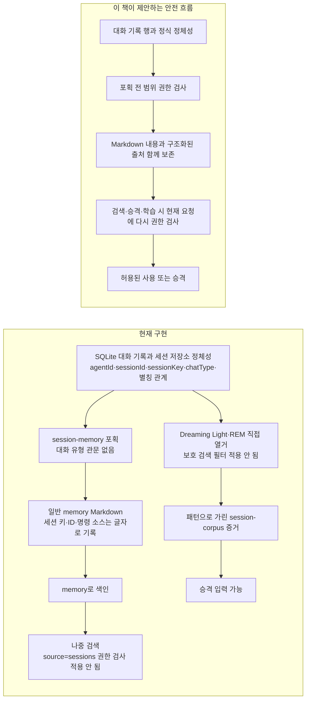

# 10장. 현재 계약의 간극과 공개 신호 백로그

앞 장의 결과 추적은 기억 실패를 여러 단계로 나누었다. 그 언어를 실제 평가에 쓰려면 먼저 소스, 테스트, 문서가 같은 동작을 약속하는지 확인해야 한다. 계약이 흔들리는 상태에서 측정값만 정교해지면 무엇을 성공으로 볼지부터 어긋난다.

2026-07-18 기준 `main`에는 문서와 런타임의 비공개 부트스트랩 불일치, Dreaming 저장소 문서의 노후화, 트랜스크립트 물질화의 별도 범위 경계가 있다. 이 판단은 오래된 이슈 설명을 옮긴 것이 아니라 기준점의 `main` 소스, 테스트, 문서를 대조한 결과다.

다만 이 장의 P0–P2는 역사적 프로젝트 분류나 링크된 이슈의 공식 우선순위 표지가 아니라, 확인된 위험을 어떤 순서로 다룰지에 관한 이 책의 제안이다. 뒤의 공개 이슈 목록도 기준점에서 재현된 현행 결함이 아니라 추가 검증을 기다리는 신호 백로그로 읽어야 한다.

[← 이전: 신호와 평가 전략](09-signal-ledger-and-evaluation.md) · [목차](README.md) · [다음: 벤치마크와 로드맵 →](11-benchmarks-and-roadmap.md)

## 확인된 간극 · 제안 우선순위 P0: 문서의 비공개 부트스트랩 약속과 런타임이 다르다

먼저 사용자가 겪을 수 있는 일을 보자.

> **합성 위험 시나리오:** 개인 워크스페이스의 `MEMORY.md`에 건강 정보나 가족 일정처럼 그룹에 공개하려 하지 않은 맥락이 있다. 사용자가 Discord 또는 Telegram 그룹에서 새 대화를 시작한다. 누구도 `memory_search`를 호출하지 않았는데도 런타임은 그 파일을 초기 모델 문맥에 넣을 수 있다. 모델이 반드시 내용을 답변으로 출력한다는 뜻은 아니지만, 문서가 비공개 세션 자료라고 설명한 원문이 공유 대화의 모델 입력에 들어갈 수 있다는 뜻이다.

### 1. 문서가 약속하는 범위

워크스페이스 템플릿과 채널 문서는 루트 `MEMORY.md`를 `main`/비공개 세션에서만 읽어야 한다고 설명한다. [에이전트 워크스페이스 문서](https://github.com/openclaw/openclaw/blob/a115af277410a91fb039d2ed699eafad706f5c73/docs/concepts/agent-workspace.md#L94-L95)와 [Discord 문서](https://github.com/openclaw/openclaw/blob/a115af277410a91fb039d2ed699eafad706f5c73/docs/channels/discord.md#L283-L290)가 그 약속을 명시한다.

### 2. 현재 런타임이 만드는 경로

현재 경로는 다음 네 단계로 그 약속을 우회한다.

1. 워크스페이스 로더는 정확한 루트 `MEMORY.md`가 있으면 시작 파일 집합에 넣는다.
2. 세션 필터는 하위 에이전트와 cron 세션 키에 대해서만 대부분의 시작 파일을 제거한다. 다른 세션 키는 전체 집합을 받는다.
3. 시작 파일을 확정하는 단계에는 대화 유형 또는 공유 세션 관문이 없다. “primary” 판정도 하위 에이전트와 ACP 작업자를 제외할 뿐 그룹·채널 세션을 제외하지 않는다.
4. 시스템 프롬프트 조립기는 남은 메모리를 내구성 있는 문맥으로 렌더링한다.

첫 단계의 소스 열거는 [`src/agents/workspace.ts`](https://github.com/openclaw/openclaw/blob/a115af277410a91fb039d2ed699eafad706f5c73/src/agents/workspace.ts#L946-L1037)에, 두 번째와 세 번째의 필터·판정은 [`src/agents/bootstrap-files.ts`](https://github.com/openclaw/openclaw/blob/a115af277410a91fb039d2ed699eafad706f5c73/src/agents/bootstrap-files.ts#L291-L337)에 있다. 링크를 열지 않아도 결론은 분명하다. **공유 대화인지 확인하는 분기가 루트 메모리를 프롬프트에 넣기 전에 존재하지 않는다.**

### 3. 이 경로가 실제 프롬프트까지 닿는다는 증거

커밋된 [Discord 그룹 프롬프트 시험 고정본(fixture)](https://github.com/openclaw/openclaw/blob/a115af277410a91fb039d2ed699eafad706f5c73/test/fixtures/agents/prompt-snapshots/codex-runtime-happy-path/discord-group-codex-message-tool.md#L470-L520)에는 필터링되지 않은 `MEMORY.md` 시작 슬롯이 있다. 이 고정본이 실제 사용자의 민감한 원문을 담았다는 뜻은 아니다. 그룹 프롬프트에도 그 슬롯이 살아 있다는 사실을 증명한다. 앞의 런타임 경로는 실제 파일 내용이 그 슬롯에 들어갈 수 있음을 보여 주고, [이슈 #108881](https://github.com/openclaw/openclaw/issues/108881)은 Telegram 그룹에서 같은 노출 유형을 독립적으로 보고한다. 코드, 실행 형태의 고정본, 사용자 보고가 서로 다른 고리를 맡는다.

### 4. 해결되지 않은 제품 정책

자동 시작 주입과 요청형 도구 회상은 같은 정책 질문이 아니다. [`memory-tools-channel-context.yaml`](https://github.com/openclaw/openclaw/blob/a115af277410a91fb039d2ed699eafad706f5c73/qa/scenarios/memory/memory-tools-channel-context.yaml)은 공유 채널에서 `memory_search`가 루트 메모리의 사실을 찾기를 명시적으로 기대하며, 메모리 프롬프트도 대화 유형으로 제한되지 않는다.

제품은 그룹에서 **자동 원문 시작 주입**은 금지하면서, 사용자가 물었을 때 **명시적이고 관련 있으며 인용된 도구 회상**은 허용할 수 있다. 전자는 파일 전체가 질문 전에 모델 입력에 들어가고, 후자는 범위 확인을 거친 관련 문단만 요청 뒤에 돌아온다. 현재 문서는 이 둘을 구분하지 않으므로 어느 정책이 공식 의도인지 확정할 수 없다.

> **합성 비교:** 그룹 대화가 시작될 때 `MEMORY.md` 전체를 자동으로 프롬프트에 넣는 것과, 그룹 구성원이 특정 질문을 했을 때 범위 확인을 거친 `memory_search`가 관련 문단 하나를 인용하는 것은 노출 면적이 다르다. 이 비교는 가능한 정책 구분이지 채택된 공식 의도의 단정이 아니다.

따라서 회상 범위를 더 넓히기 전에 다음 다섯 조건을 먼저 충족하자는 것이 이 책의 제안이다.

1. 직접 대화, 비공개 대화, 직접 스레드, 그룹, 공유 스레드별로 시작 주입과 도구 회상 정책을 결정하고 문서화한다.
2. 비공개 시작 주입 약속을 유지하려면 프롬프트 조립 전에 대화 유형과 세션 정체성으로 강제한다.
3. 훅이 수정한 시작 파일 집합도 같은 정책으로 다시 검증한다.
4. 직접 대화와 직접 스레드의 허용 사례, 비공개 대화 간 회상·그룹·공유 스레드의 차단 및 격리 스냅샷을 추가한다.
5. 인용과 학습 전 권한 검사는 유지한다. 동시에 세션별 자격 검사를 후보 순위화·최종 제한 앞으로 옮기거나, 안전하게 더 많이 가져온 뒤 필터링하고 빈 결과를 보충해 차단된 적중이 보이는 상위 K개를 굶기지 않게 한다.

## 확인된 간극 · 제안 우선순위 P0/P1: Dreaming 저장소 문서가 레거시 구현을 설명한다

기준점의 [Dreaming 문서](https://github.com/openclaw/openclaw/blob/a115af277410a91fb039d2ed699eafad706f5c73/docs/concepts/dreaming.md#L17-L22), [메모리 개요](https://github.com/openclaw/openclaw/blob/a115af277410a91fb039d2ed699eafad706f5c73/docs/concepts/memory.md#L258-L280), [설정 참조](https://github.com/openclaw/openclaw/blob/a115af277410a91fb039d2ed699eafad706f5c73/docs/reference/memory-config.md#L793-L798)는 활성 상태가 `memory/.dreams/` 아래에 있다고 말한다. Dreaming 문서는 [`phase-signals.json`을 포함한 예전 배치](https://github.com/openclaw/openclaw/blob/a115af277410a91fb039d2ed699eafad706f5c73/docs/concepts/dreaming.md#L98-L106)도 제시한다.

하지만 [`3f5e00184431`](https://github.com/openclaw/openclaw/commit/3f5e00184431f10a7ae55c59ce8d3c6cb0d0a0eb) 이후 해당 기계 상태는 SQLite 플러그인 상태 이름공간에 있다. 현재 소유자는 [Dreaming 상태 어댑터](https://github.com/openclaw/openclaw/blob/a115af277410a91fb039d2ed699eafad706f5c73/extensions/memory-core/src/dreaming-state.ts#L1-L163)이며, 예전 JSON 경로는 doctor 마이그레이션 입력으로만 남는다.

파일 기반 산출물이 모두 사라진 것은 아니다. `.dreams/` 계열에는 다음 대화 기록 코퍼스 증거가 남고, 그 밖에도 이름이 정해진 파일 산출물이 있다.

- 패턴으로 가린 `memory/.dreams/session-corpus/YYYY-MM-DD.txt` 증거는 예전 경로 형식으로 남아 있다.
- 그 밖에 `DREAMS.md`, 단계·섀도 보고서, 크기가 제한된 공개 메모리 이벤트 내보내기가 이름 있는 파일 산출물로 남는다.
- 내보내기 도구는 내부·생성 메시지 종류를 버리고 [등록된 비밀값과 패턴 기반 가림](https://github.com/openclaw/openclaw/blob/a115af277410a91fb039d2ed699eafad706f5c73/src/logging/redact.ts#L1044-L1063)을 적용한다. 개인 내용을 일반적으로 익명화하는 것은 아니다.

따라서 올바른 설명은 “`.dreams`가 사라졌다”가 아니다. **활성 기계 상태는 SQLite에 있고, 선택된 검토·증거 산출물은 파일로 남는다**가 정확하다.

같은 Dreaming 문서에는 섀도 판정이 순서를 바꿀 수 있다는 설명과 엔진 점수에는 영향을 주지 않는다는 설명이 함께 있다. 현재 코드와 역사는 후자를 지지한다. 제안된 메모리의 검토가 조언인지 자동 결정인지 사용자가 알아야 하므로 이 모순은 중요하다.

## 확인된 간극 · 제안 우선순위 P0/P1: 트랜스크립트 포획은 세션 가시성보다 오래 남을 수 있다

여기서 사용자 위험은 “검색 결과 하나를 잘못 보여 준다”보다 오래 간다. 대화 기록의 일부가 일반 Markdown으로 복사되면 나중 검색은 그 문서를 대화 기록이 아니라 보통 메모리로 본다. 원래 대화의 권한 검사를 고쳐도 이미 복사된 문서에는 자동으로 소급되지 않는다.

보호된 대화를 대상으로 하는 직접 `memory_search`는 신뢰된 회상의 소스를 대화 기록으로 제한한다. 백엔드가 후보를 순위화하고 상위 K개를 제한한 뒤, 각 결과를 에이전트, 비공개 대화 유형, 기준 대화, 현재 대화, 모든 별칭, 샌드박스 조건으로 검사한다. 이 검사는 인용·사용자 노출·Dreaming 회상 추적보다 먼저이지만 대화 기록 색인과 백엔드 순위화·제한보다 나중이다. 정식 순서는 [1장](01-current-architecture.md#canonical-session-authorization)에 있다.

**물질화(materialization)**는 대화 기록 행의 일부를 다른 저장 형태의 산출물로 쓰는 일이다. 기준점에는 보호 검색과 다른 경계를 가진 두 포획 경로가 있다.

- 번들 `session-memory` 훅을 켜면 `/new` 또는 `/reset`이 제한된 대화 기록 꼬리를 일반 `memory/` 노트로 쓸 수 있다. 이 포획에는 대화 유형 관문이 없다.
- Dreaming을 켜고 Light 또는 REM이 실행되면 해당 단계가 보호 검색의 비공개·그룹 필터를 거치지 않고 워크스페이스와 연결된 에이전트의 준비된 대화 기록 코퍼스를 직접 열거한다. 패턴으로 가린 세션 증거를 쓰고 승격 입력으로 사용할 수 있다. 별도로 문서화된 대화 기록 수집 전환 설정은 없다.

### 현재 흐름과 제안하는 안전 흐름

현재 `session-memory` 노트의 머리말은 표시용 **세션 키, 세션 ID, 명령 소스**를 문자열로 남긴다. 그러나 검색 색인이 권한 판정에 쓰는 구조화된 `source=sessions`, 소유 에이전트, 대화 유형, 모든 별칭, 기준 대화와의 관계는 일반 `source=memory` 결과에 이어지지 않는다. 즉, 정체성 글자가 완전히 사라지는 것이 아니라 **권한 검사가 소비할 수 있는 형태와 결합이 사라진다**. Dreaming도 수집할 때는 준비된 에이전트·대화 정체성을 사용하지만, 만들어진 증거가 보호 검색의 `source=sessions` 결과로 남는 것은 아니다.

오른쪽 흐름은 현재 동작을 설명하는 것이 아니라 이 책의 제안이다. 필요한 구조화된 출처의 최소 집합은 소유 에이전트, 원본 세션 키·세션 ID, 대화 유형, 같은 대화 기록의 별칭, 포획 당시 기준 대화와 정책 버전이다. 저장 형식은 별도 설계 문제지만, 이후 검색·승격·학습 단계가 현재 요청과 다시 비교할 수 있어야 한다.

이 간극을 닫기 위한 다음 단계는 네 가지다.

- 직접 대화, 직접 스레드, 그룹, 공유 스레드별 포획 범위를 따로 정의한다.
- 물질화 뒤에도 원본 에이전트·세션·대화 유형·기준 대화의 출처 정보를 유지한다.
- 승격과 검색 학습 전에 현재 요청을 기준으로 다시 권한을 검사한다.
- [7장의 허용·차단 행렬](07-july-2026.md#conversation-recall-allow-block)의 모든 경로를 시험한다.

코드 근거는 [`memory_search` 실행 순서](https://github.com/openclaw/openclaw/blob/a115af277410a91fb039d2ed699eafad706f5c73/extensions/memory-core/src/tools.ts#L620-L759), [`session-memory` 처리기](https://github.com/openclaw/openclaw/blob/a115af277410a91fb039d2ed699eafad706f5c73/src/hooks/bundled/session-memory/handler.ts#L238-L348), [세션 결과 가시성 검사](https://github.com/openclaw/openclaw/blob/a115af277410a91fb039d2ed699eafad706f5c73/extensions/memory-core/src/session-search-visibility.ts#L157-L375), [Dreaming 대화 기록 열거](https://github.com/openclaw/openclaw/blob/a115af277410a91fb039d2ed699eafad706f5c73/extensions/memory-core/src/dreaming-phases.ts#L802-L947)다. 각각 검색 후 권한 검사, 일반 Markdown 쓰기, 결과별 판정, 별도 직접 수집이라는 서로 다른 경계를 증명한다. 이 차이는 정책·적합성 간극을 확립하지만, 그 자체만으로 보안 판정이나 의도된 제품 경계를 확정하지는 않는다.

## 확인된 간극 · 제안 우선순위 P1: “숨은 상태가 없다”에는 의미론적 한정이 필요하다

[공식 메모리 개요](https://docs.openclaw.ai/concepts/memory)는 모델이 디스크에 저장된 것만 기억하며 숨은 상태가 없다고 설명한다. 사용자가 보는 의미 메모리가 검사 가능한 Markdown이라는 취지는 중요하다. 그러나 이 문장을 문자 그대로 적용하면 현재 전체 구조를 설명하지 못한다.

Markdown 밖에는 파생 색인, 회상 관찰, Dreaming 체크포인트, 대화 기록 행, 캐시, 플러그인 상태가 있다. 이 현실을 반영해 현재 설명을 더 정확히 한정하면 다음과 같다. 이는 기존 문구를 대신할 공식 계약이 아니라 이 책이 제안하는 표현이다.

> OpenClaw의 내장 내구성 의미 메모리는 사용자가 검사할 수 있는 Markdown이다. 검색 색인과 운영·통합 상태는 파생되거나 기계가 소유하며, 공개되지 않은 경쟁 기준 원본이 되어서는 안 된다.

이 한정은 내장 기본 `memory-core` 경로를 말한다. LanceDB처럼 별도 의미 저장소를 소유하거나 Honcho처럼 외부 모델을 추가하는 대안 플러그인까지 Markdown 전용이라고 일반화해서는 안 된다.

## 확인된 간극 · 제안 우선순위 P1: `main` 문서와 출시 동작의 시점이 잠시 어긋난다

기준점의 설정 문서는 개인형 설치에서 `rememberAcrossConversations`가 기본으로 켜진다고 설명한다. 이 책이 조사한 기준점의 `main`에서는 맞는 말이다. 그러나 이를 켠 두 커밋은 기준점 당시 어떤 `v*` 태그에도 아직 포함되지 않았다.

따라서 이전 릴리스의 실행 파일을 쓰면서 소스 문서를 읽는 운영자는 자신의 실행 파일에 없는 기본값을 볼 수 있다. 이 책은 호환성과 메모리 프라이버시에 민감한 설정에 릴리스 범위 문서 또는 눈에 띄는 버전 안내가 필요하다고 본다.

## 확인된 간극 · 제안 우선순위 P1: 리셋 포획에는 동등한 의미 플러시가 없다

`session-memory` 훅은 `/new` 또는 `/reset`에서 길이가 제한된 대화 기록 꼬리를 보존한다. 반면 압축 전 플러시는 모델에게 오래 남길 정보를 선별하도록 요청한다. [이슈 #45608](https://github.com/openclaw/openclaw/issues/45608)이 기준점에서도 열린 이유는 두 동작이 동등하지 않기 때문이다.

안전한 설계는 리셋 선별을 위해 추가 모델 호출과 지연을 감수할 가치가 있는지 결정해야 한다. 도입한다면 뒤에만 추가하기, 제한된 재시도, 주 응답을 막지 않기라는 조건을 함께 설계해야 한다.

## 확인된 간극 · 제안 우선순위 P1/P2: 메모리 적합성에는 세 가지 소유권 경계가 있다

현재 표면은 하나의 상호 교환 가능한 “공급자” 추상화가 아니다. 구성 요소별 현재 위치는 [1장의 소유권 기준표](01-current-architecture.md#canonical-component-ownership)에 모아 두었다.

1. `memory-core`와 `memory-lancedb`는 배타적 메모리 플러그인 슬롯을 소유할 수 있다.
2. 내장 SQLite/FTS/벡터 검색과 QMD는 `memory-core` 내부 백엔드다.
3. Memory Wiki와 외부 Honcho는 슬롯을 소유하지 않고 프롬프트, 코퍼스, 회상을 보충하는 추가형 플러그인이다.

이 계층 사이에서 플러그인과 백엔드는 다음 계약이 다르다.

- 자동으로 캡처하는 내용
- 내용이 사용자가 편집하는 원본인지 추출 레코드인지
- 선제 회상인지 도구 요청형 회상인지
- 삭제·내보내기·마이그레이션 동작
- 에이전트·대화·그룹 범위
- 인용과 출처 정보의 품질
- 실패와 폴백의 의미

슬롯은 첫 번째 계층의 배타적 소유권만 해결한다. 별도의 적합성 계약이 슬롯 플러그인, 백엔드, 추가형 플러그인의 의미를 선언해야 사용자와 QA가 모든 표면이 `memory-core`처럼 동작한다고 가정하지 않고 설정을 비교할 수 있다.

## 확인된 간극 · 제안 우선순위 P2: 겹치는 회상 도구에는 라우팅 증거가 필요하다

`memory_search`, `memory_get`, `sessions_search`, Active Memory, 플러그인별 도구는 서로 다른 일을 해결한다. 그래도 모델은 잘못된 도구를 고를 수 있다.

질의 종류와 결과를 계측해 정확 대화 기록 FTS, 내구성 의미 검색, 선제 회상이 각각 언제 이기는지 배워야 한다. 깨지기 쉬운 프롬프트 전용 라우터를 먼저 만들기보다 자동 라우팅의 평가 근거를 먼저 확보하는 순서가 타당하다.

## 공개 보고를 신호 백로그로 다루기

다음 항목은 요청 또는 특정 버전에서 나온 보고다. 기준점에 대해 다시 재현하지 않은 항목은 확정된 현재 결함으로 취급하지 않는다.

| 보고                                                                                                                      | 미래 작업을 위한 신호                                                                                                                         |
| ------------------------------------------------------------------------------------------------------------------------- | --------------------------------------------------------------------------------------------------------------------------------------------- |
| [#40088](https://github.com/openclaw/openclaw/issues/40088)                                                               | 파일 감시기가 조용히 멈출 수 있다. 최신성에는 살아 있는 파일 서술자가 아니라 처음부터 끝까지 확인하는 리비전 SLO가 필요하다.                  |
| [#71285](https://github.com/openclaw/openclaw/issues/71285)                                                               | `memory/dreaming/`의 생성 단계 Markdown은 승격에서 제외되더라도 검색될 수 있다. 검색 자격과 승격 자격에 별도의 명시적 정책이 필요하다.        |
| [#77831](https://github.com/openclaw/openclaw/issues/77831), [PR #78130](https://github.com/openclaw/openclaw/pull/78130) | Dreaming 대화 기록 코퍼스 증거가 승격 신호를 지배하고 선별 메모리를 오염시킬 수 있다.                                                         |
| [#87660](https://github.com/openclaw/openclaw/issues/87660)                                                               | 사용자는 불투명한 뒤에만 추가하는 성장보다 잠금·안정·변화·노후(`locked`/`stable`/`evolving`/`stale`) 등급과 차이를 보여 주는 선별기를 원한다. |
| [#90354](https://github.com/openclaw/openclaw/issues/90354)                                                               | 뒤에만 추가하는 플러시에도 크기·줄 수 상한, 검증, 되돌리기, 무응답 모드 증명이 필요하다.                                                      |
| [#92633](https://github.com/openclaw/openclaw/issues/92633)                                                               | 각 분기는 성공하는데 `corpus=all`은 실패할 수 있다. 전체 실패보다 부분 결과와 분기별 진단이 나을 수 있다.                                     |
| [#95724](https://github.com/openclaw/openclaw/issues/95724)                                                               | 같은 워크스페이스의 에이전트가 색인, 감시기, 임베딩 비용을 중복한다. 공유하려면 명시적인 소스 소유자·참조 수·프라이버시 설계가 필요하다.      |
| [#96534](https://github.com/openclaw/openclaw/issues/96534)                                                               | 공급자가 복구된 뒤에도 폴백 임베딩 정체성이 고정된 채 남을 수 있다. 생명주기 소유권과 건강 상태 전이의 증명이 필요하다.                       |
| [#101422](https://github.com/openclaw/openclaw/issues/101422)                                                             | 큰 Markdown 우선 워크스페이스에는 검색을 숨은 발견 정책으로 만들지 않는 명시적 포함·제외 자격이 필요하다.                                     |
| [#106239](https://github.com/openclaw/openclaw/issues/106239)                                                             | 재시작 때 기본 에이전트의 색인 정체성이 사라질 수 있다. 정체성 내구성을 검증하는 재시작 고정본이 필요하다.                                    |
| [#110665](https://github.com/openclaw/openclaw/issues/110665)                                                             | 네이티브 라우팅이 일반 메모리 기능이 아니라 이름이 정해진 도구를 인식한다. 플러그인 대체 범위가 허용 목록보다 커질 수 있다.                   |
| [#67419](https://github.com/openclaw/openclaw/issues/67419), [#94295](https://github.com/openclaw/openclaw/issues/94295)  | 프롬프트 비용 절감과 자동 루트 메모리 노출 사이의 긴장이 남아 있다.                                                                           |

이 백로그의 역할은 “모두 당장 고쳐야 할 확정 버그” 목록이 아니다. 어느 신호를 재현하고, 어떤 계약 소유자와 시험 행렬로 승격할지 결정하는 입력이다.

## 다음 장으로

현재 계약의 간극은 그대로 평가 의무가 된다. 비공개 부트스트랩, 트랜스크립트 물질화, 저장소 설명, 플러그인 소유권이 합의되지 않으면 높은 회상 점수도 범위와 생명주기를 지켰다는 증명이 될 수 없다.

다음 장은 이 의무를 실행 가능한 로드맵으로 바꾼다. 이미 공개된 평가 자산 가운데 무엇을 작은 어댑터로 재사용할 수 있는지 살피고, OpenClaw 고유의 적합성 증명과 어떤 순서로 결합해야 하는지 정리한다.

---

[← 이전: 신호와 평가 전략](09-signal-ledger-and-evaluation.md) · [목차](README.md) · [다음: 벤치마크와 로드맵 →](11-benchmarks-and-roadmap.md)
